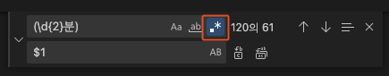

## \역슬래쉬
\d : 숫자 <br></br>
\D : 문자 <br></br>

### {숫자} 
숫자만큼 반복 <br></br>
\d{3} : 3자리 숫자 <br></br>

## []
[] 사이의 문자들과 매치 <br></br>
### not 
```dart
[^a-z] : 문자가 아닌 숫자와 매치
[^0-9] : 숫자가 아닌 문자와 매치 
```

### 특정 문자 사이에 모든 값 찾기
str1과 str2 사이에 있는 모든 문자열 찾음<br></br>
```dart
str1 (.*?) str2
```


## 변수
() 안에 있는 문자열을 하나의 그룹으로 묶어서 관리 <br></br>
(\d{3})-(\d{4})-(\d{4}) : 010-1234-5678 <br></br>
$1 : 010 <br></br>
$2: 1234 <br></br>
$3 : 5678 <br></br>

## VScode 찾기 정규식 사용법


