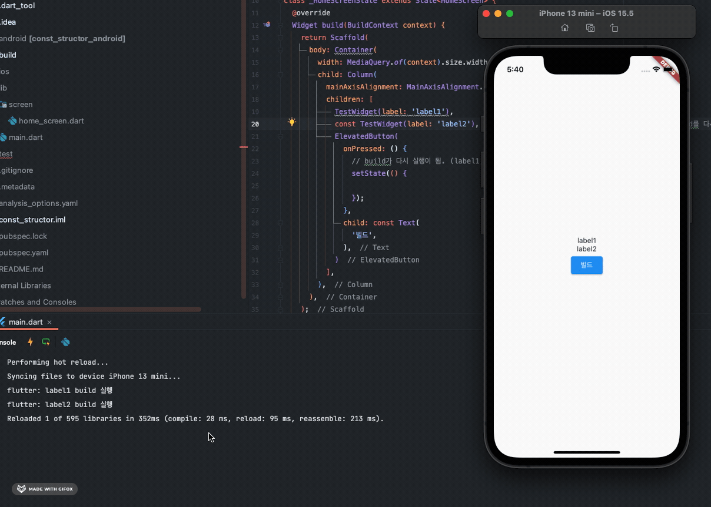

# 기본 문법
## 기본 자료형

[기본 자료형](https://github.com/rookedsysc/Flutter-Study/commit/86a5ec735d6aae7c77a42eedef279ca8c327aaf2)

## Final과 Const
[Final과 Const](https://github.com/rookedsysc/Flutter-Study/commit/db4bc1b31c8eb0f5ca547b7d45ea031e2cf2ba3c)

### const re-build
[const로 선언된 property](https://github.com/rookedsysc/Flutter-Study/blob/main/Project/const_structor/lib/screen/home_screen.dart)는 re-build를 해도 다시 load되지 않음.<br></br>
아래는 hot restart를 통해서 처음 build가 되고 난 이후에 "빌드" button을 눌려도 const로 선언된 label2 property는 다시 load되지 않는 현상 👇.<br></br>

### Reference
[setState란?](http://lokigem.github.io/docs/Flutter/flutterTheory/widget/##setstate)

## 타입
### 타입 검사 (is)
[Operation:: is와 is!](https://github.com/rookedsysc/Flutter-Study/commit/27eec1b2fad060393648e8f7ed6a8ada2e6a1440)

### 캐스팅(as)
기본 사용법 👇
```dart
인스턴스 as type // (1)
```
인스턴스를 type으로 변환해줌. 타입을 명시할 때도 사용함.

- 다운 캐스팅 :

부모 클래스를 자식 클래스로 타입 캐스팅

- 업 캐스팅 : 

자식 클래스를 부모 클래스로 타입 캐스팅 하는 것을 업 캐스팅이라고 함
## List와 Map
[List와 Map](https://github.com/rookedsysc/Flutter-Study/commit/2046748443b5237be5c310587b533becee62de2c)

### sublist(List 범위)
start와 end 사이의 요소가 포함 된 새 목록을 반환함. <br></br>
end에 써져 있는 인덱스는 포함하지 않음.
```dart
List.sublist(start index >= , end index < )
```

<details>
<summary>예시</summary>
<div>

```dart
for(StatModel stat in value) {
  // key 값에 dataTime을 넣어줌으로써 데이터가 절대로 중복되지 않음
  box.put(stat.dataTime.toString(), stat);

  final allKeys = box.keys.toList();

  if(allKeys.length > 24) {
    final deleteKeys = allKeys.sublist(0, allKeys.length - 24); // 마지막 24개 남기고 다 지움
    box.deleteAll(deleteKeys);
  }
}
```

</div>
</details>


### List To Map 
asMap()을 사용하면 "Key = List index number" : "value = List Value" 형식으로 저장됨. 즉, asMap으로 만들어진 Map의 **Key값이 List의 index number**가 되는 것. 
```dart 
List.asMap()
```
- Reference :

[예제코드](https://github.com/rookedsysc/Flutter-Study/blob/main/Grammar/map_plus.dart)

### entries
Map 자료형에 .entries를 하면 MapEntry(key: value)로 모든 Map의 값들을 출력해줌.
## Set
[Set](https://github.com/rookedsysc/Flutter-Study/commit/710622428dd3ecd1fd8183e4b96df4116eb975fd)
### .from
.from에 넣어준 반복 가능한 instance에서 중복을 제거해줌.
```dart
Set<E>.from(
Iterable elements
)
```
## 조건문
[조건문](https://github.com/rookedsysc/Flutter-Study/commit/0c056730dd07ba90079adc20cd66f911d8855d58)
## 반복문
[반복문](https://github.com/rookedsysc/Flutter-Study/commit/b7e1c0a26e2fdb5d1e1b66c0ea627b6e20ba42be)
## enum
[enum](https://github.com/rookedsysc/Flutter-Study/blob/main/Grammar/enum.dart)

### Value를 String으로 가져오기 (.name)
## 함수와 typedef
signature: return 타입과 parameter의 형태를 signature라고 함 <br></br>
typedef로 선언해놓은 함수에 같은 시그니처의 함수를 대입해주고 해당 typedef를 이용해서 연산을 수행해줌.
```dart 
// typedef 선언
typedef Operation = int Function(int x, int y, int z);
// 같은 시그니처의 method 선언.
int substact (int x, int y, int z) => x - y - z;
// 사용, 같은 시그니처의 함수를 대입해서 연산해줌.
operation = substact;
int result2 = operation(30, 20, 5);
```
[함수와 typedef](https://github.com/rookedsysc/Flutter-Study/commit/2961231678821071d95b016158bc990780ee2b6e)
