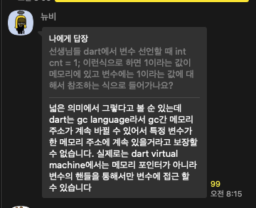

# immutable data
## immutable data란?
직역 : 변하지 않는 데이터. <br></br>
만약에 값을 선언할 때 
```dart
int cnt = 1;
cnt = 2;
```
이런식으로 값을 선언하고 2라는 값을 넣게 되면 0x02000000에 있던 값(예를 들어) 1에서 0x02000004에 있는 값 2로 대치 된 것이지 0x02000000에 있던 값이 변한게 아님(immutable data). <br></br>
그에 반해서 
```dart
List<int> cntArray = [1];
cntArray.add(2);
```
다음과 같이 할 때 cntArray[0]의 인덱스 주소는 고정이 되고 해당 주소의 값이 변경됨. 이러한 데이터를 mutable data라고 함.<br></br><br></br>
즉, 값이 변경 > mutable<br></br>
해당 주소의 값은 고정이 된 채 주소가 변경 > immutable

## Dart에서 변수 할당 방식

```dart
var str = 'This is a String.'
str = 'This is another String.'
```

다음과 같은 변수를 선언하고 String을 할당했다고 칠 때, 'This is a String.'이라는 문자열 리터럴을 만들고 변수에는 해당 값의 위치에 대한 참조가 들어가 있음. 
두 번째 줄에선 완전히 새로운 문자열을 만들고 첫 번째 문자열에 대한 참조를 두 번째 문자열에 대한 참조로 덮어쓰게 됨. 
첫 번째 문자열은 해당 문자열에 대한 유효한 참조가 더 이상 없으면 도달할 수 없는 문자열로 표시되고 Dart의 **garbage collector**에 의해서 해당 문자열의 메모리가 해방됨.

++ Fluuter Developers Korea<br></br>
{: width="50%"}

### garbage collector 
메모리에 들어 있는 안쓰는 변수 등을 개발자가 다 해제 시켜주기 귀찮아서 이러한 일을 자동으로 해주는 것이 garbage collector임.


## final과 const
둘은 값을 한 번 지정하게 되면 바꿀 수 없다는 공통적인 속성을 가지고 있음.

```dart
final cnt = 1; 
cnt = 2; // error
```

### 차이점
final은 선언시 값을 부여하지 않고 이후 최초 1번 값을 부여할 있음.<br></br>
final은 이 파일이 실행될 때 해당하는 code의 위치에서 값이 결정되지만 const는 compile할 때에 값이 결정됨.(**complie-time constants**)

### final list
list를 final로 선언하면 레퍼런스(참조)만 immutable이고 객체 내부는 mutable이라서 값을 변경하는 것은 가능함. 
즉, 참조 값을 변경하는 경우에만 오류가 발생함. 
```dart
void main() {
  final List<int> a = [1,2,3];
  a.add(4); // 됨
  print(a);
  a[0] = 5; // 됨
  print(a);
  a = [2,3,4]; // error 발생 
}
```
내가 이해한 대로 정리를 해보자면 [1,2,3]이라는 리스트의 주소(참조 값)을 담고 있었는데 이를 다른 [2, 3, 4]라는 다른 리스트의 주소(참조 값)으로 변경해주게 되면 오류가 나는 것 같음. 


## class의 mutable한 속성
```dart
void main() {
  User user1 = User(name: '지은', age: 30);
  User user2 = user1;
  
  user2.name = '용준'; // user2에서 이름을 바꿔도 참조하는 주소가 같기 때문에
  print(user1.name); // 용준 출력
}

class User {
  String? name;
  int? age;
  
  User({this.name, this.age});
}
```

