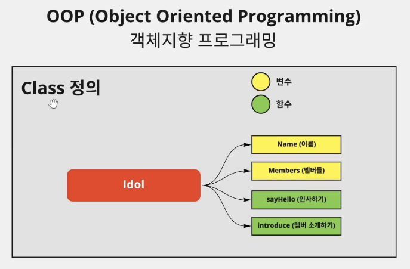

# 객체지향 프로그래밍

```mdx-code-block
import Tabs from '@theme/Tabs';
import TabItem from '@theme/TabItem';
```

## 객체지향 프로그래밍
객체지향 프로그래밍(OOP, Object Oriented Programming)이란? <br></br>
Class의 인스턴스를 생성해서 할당을 해주면 해당하는 인스턴스를 무한히 생성가능.<br></br>

### 객체지향 프로그래밍(OOP)인 이유
class를 기본적으로 생성해주면 hashCode, runtimeType, toString, noSuchMethod 등이 기본적으로 할당이 됨. 이는 class가 생성될 때 **모든 class는 최상위 부모 class로 Object를 가지고 있기 때문**. 그리고 이 Object의 기본적으로 제공이 되는 기능이 저 4가지 기능임.
```dart
void main() {
    Test test = Test();

    // 기본적으로 할당되어 있음
    test.hashCode;
    test.runtimeType;
    test.toString();
    test.noSuchMethod(invocation);
}

class test entends Object{}
``` 

### class 기본형

```dart
void main() {
  Idol blackPink = Idol(
    "블랙핑크",
    ['제니', '지수', '리사', '로제'],
  );

  blackPink.sayHello();
  blackPink.introduce();

  Idol bigBang = Idol( // 일반적인 생성자
    "빅뱅",
    ["권지용", "최승현", "패배", "동영배", "강대성"],
  );
  Idol namedBigBang = Idol.fromList( // nammed 생성자 할당
    [
      ["권지용", "최승현", "패배", "동영배", "강대성"],
      "빅뱅",
    ]
  );
  bigBang.sayHello();
  bigBang.introduce();
  namedBigBang.sayHello();
  namedBigBang.introduce();
}

class Idol {
    String name = "블랙핑크";
    List<String> members = ['제니', '지수', '리사', '로제'];

    void sayHello() {
      print("안녕하세요. ${this.name} 입니다.");
    }
    void introduce() {
      print('저희 멤버는 ${this.members}가 있습니다.');
    }

    /* constructor (생성자)
    this는 현재 class의 프로퍼티를 나타냄 */
    // Idol(String name, List<String> members): this.name = name, this.members = members;
    Idol(this.name, this.members);
    // named constructor
    Idol.fromList(List values):this.members = values[0], this.name = values[1];
}
```

#### Constructor

##### Named Constructor 

```dart
class Employee {
  int empID;
  String empName;

  Employee.ID(this.empID); // Named Constructor Creation
  Employee.name(this.empName);
}

main() {
  var myEmployee01 = new Employee.ID(15);
  var myEmployee03 = new Employee.name("rookedsysc");

  print(myEmployee01.empID); // 15
  print(myEmployee03.empName); // rookedsysc
}
```

##### Factory Contsructor
https://stackoverflow.com/questions/60133252/what-is-the-purpose-of-a-factory-method-in-flutter-dart
```dart
class DBHelper{
  static final DbHelper _dbHelper = DbHelper._internal();
  DbHelper._internal();
  factory DbHelper() => _dbHelper;
}
```
다음 코드에서 factory 키워드를 DBHelper 메서드 앞에서 써놓으면 DBHelper 메서드의 인스턴스는 딱 한 번만 생성될 수 있음.<br></br>

#### immutable 프로그래밍: final
한 번 값을 선언하고 나면 값을 변형할 수 없도록 해줌.<br></br>
```dart
void main() {
  Idol blackPink = Idol(
    "블랙핑크",
    ['제니', '지수', '리사', '로제'],
  );
  // blackPink.name = "아이유"; // error 발생
  blackPink.sayHello();
  blackPink.introduce();
}

class Idol {
  // imutable 프로그래밍 : 선언한 이후에 값을 변경할 수 없도록 해줌.
  final String name;
  List<String> members;

  void sayHello() {
    print("안녕하세요. ${this.name} 입니다.");
  }
  void introduce() {
    print('저희 멤버는 ${this.members}가 있습니다.');
  }

  Idol(this.name, this.members);
}
```
#### immutable 프로그래밍: const
```dart
void main() {
  Idol blackPink = const Idol( // const를 사용할 때는 값을 선언하는 부분에도 const로 변수를 만들어줘야 함
    "블랙핑크",
    ['제니', '지수', '리사', '로제'],
  );
  // blackPink.name = "아이유"; // error 발생
  blackPink.sayHello();
  blackPink.introduce();
}

class Idol {
  final String name;
  final List<String> members;

  void sayHello() {
    print("안녕하세요. ${this.name} 입니다.");
  }
  void introduce() {
    print('저희 멤버는 ${this.members}가 있습니다.');
  }
  // imutable 프로그래밍 : 선언한 이후에 값을 변경할 수 없도록 해줌.
  const Idol(this.name, this.members);
}
```
##### const immutable class의 특수성
같은 class의 인스턴스 프로퍼티를 비교할 때 const로 선언한 class 인스턴스끼리는 값이 같으면 같다고 return 해줌.
```dart
void main() {
  Idol blackPink = Idol( // const를 사용할 때는 값을 선언하는 부분에도 const로 변수를 만들어줘야 함
    "블랙핑크",
    ['제니', '지수', '리사', '로제'],
  );
  Idol blackPink2 = Idol(
    "블랙핑크",
    ['제니', '지수', '리사', '로제'],
  );
  Idol bigBang = const Idol (
    "빅뱅",
    ['GD', 'TOP', '대성', '태양', '패배'],
  );
  Idol bigBang2 = const Idol (
    "빅뱅",
    ['GD', 'TOP', '대성', '태양', '패배'],
  );
  print(blackPink == blackPink2); // false 출력
  print(bigBang == bigBang2); // true 출력 (const로 선언한 class는 값을 비교하면 같다고 return해줌)
}

class Idol {
  final String name;
  final List<String> members;

  void sayHello() {
    print("안녕하세요. ${this.name} 입니다.");
  }
  void introduce() {
    print('저희 멤버는 ${this.members}가 있습니다.');
  }
  // imutable 프로그래밍 : 선언한 이후에 값을 변경할 수 없도록 해줌.
  const Idol(this.name, this.members);
}
```
### Getter와 Setter
```dart
자료형 get getterName {
	code
}
```
와 같은 형태로 사용하며, setter는 잘 안씀.<br></br>
데이터를 가져와서 { code }를 수행해줌.
[Getter와 Setter](https://github.com/rookedsysc/Flutter-Study/commit/a5199f9ec1fe5573748401023b75d355ecffa982) 
### Inheritance (상속)
[Ingeritance](https://github.com/rookedsysc/Flutter-Study/commit/3b1f33e19fa8f891d0be56014fc590637ab2ef96)
### Override
부모 클래스에 있는 method와 같은 시그니처의 함수를 만들어서 덮어쓰기(override)해줄 수 있음.<br></br>
[Override](https://github.com/rookedsysc/Flutter-Study/commit/2d7f4599e00b3c21c360d170b82b6dbe3b0d13bf)
### static
class 내부의 method나 property에 static을 붙여서 사용하며, 이는 instance가 아닌 class에 값이 귀속됨. 즉, 해당 class에 static method나 property를 귀속해주면 해당 class를 상속받은 모든 자식 class 는 해당 static의 값을 귀속받음.<br></br>
[static](https://github.com/rookedsysc/Flutter-Study/commit/8dc1037da3d001a3c20c5d8d43c823e52aa476d8)
### Interface와 abstract
어떤 특수한 구조를 강제하기 위해서 사용하며 swift의 protocol이랑 비슷함. <br></br>
Interface 앞에 **abstract** 키워드를 사용해서 해당 Interface를 통해서 instance를 생성할 수 없도록 해줌.<br></br>
[Interface와 abstract](https://github.com/rookedsysc/Flutter-Study/commit/4c324c49d1449f66c87cab17953d9dd04a8c5a5e)
### Generic (타입추론)
class에 타입을 외부에서 받을 때 사용하며 외부에서 타입을 지정해줌.<br></br>
아래는 기본형 👇
```dart
인스턴스명<Generic>() {
}
```
[generic](https://github.com/rookedsysc/Flutter-Study/commit/f9a665156b1537bffbbb1df0839f2adc98d3b1b1)
## 변수 선언
### Private 변수
private 변수는 해당 파일 밖에서 사용할 수 없는 변수를 뜻함.<br></br>
변수/함수/Class 등의 이름 앞에 (&##95;) 추가.<br></br>
이 때 class를 할당 해주거나 변수를 참조할 때도 이름 앞에 (&##95;)를 붙여줘야 함.
```dart
class _Idol {
	final String name;
	final List<String> memebers;

	_Idol(this.name, this.members);
}
```

## Cusotm Copywith
.copywith 함수를 custom으로 구현해보기. <br></br>
구현하는 이유: class에는 final로 함수가 선언되어 있기 때문에 해당하는 값을 변경할 수 없음. 그래서 class_instance에 .copywith 메서드를 사용해서 해당 값을 불러온 후 바꿀값만 바꿔서 새로운 instance로 할당해서 사용하는 방식을 사용함.<br></br>

<Tabs>
  <TabItem value="선언" label="Declation">

  ```dart
  class ShoppingItemModel {
    final String name; // 이름
    final int quantity; // 갯수
    final bool hasBought; // 구매 했는지
    final bool isSpicy; // 매운지;
    ShoppingItemModel(
        {required this.name,
        required this.quantity,
        required this.hasBought,
        required this.isSpicy});

    ShoppingItemModel copyWith({
      String? name,
      int? quantity,
      bool? hasBought,
      bool? isSpicy,
    }) {
      return ShoppingItemModel(
          name: name ?? this.name,
          quantity: quantity ?? this.quantity,
          hasBought: hasBought ?? this.hasBought,
          isSpicy: isSpicy ?? this.isSpicy);
    }
  }
  ```

  </TabItem>
  <TabItem value="실행 결과" label="Result">

  ```dart
  void main() {
    ShoppingItemModel _item1 = ShoppingItemModel(name: '김치', quantity: 5, hasBought: true, isSpicy: true);
    ShoppingItemModel _item2 = _item1.copywith(name: "Spaghetti", isSpicy: false, hasBought: false);
    
    // 김치 5 true true
    print("${_item1.name} ${_item1.quantity} ${_item1.hasBought} ${_item1.isSpicy}");
    // Spaghetti 5 false false
    print("${_item2.name} ${_item2.quantity} ${_item2.hasBought} ${_item2.isSpicy}");
  }
  ```

  </TabItem>
</Tabs>

