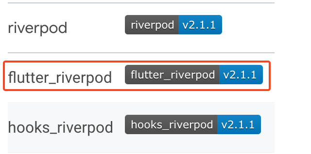

# Riverpod

```mdx-code-block
import Tabs from '@theme/Tabs';
import TabItem from '@theme/TabItem';
```

## How To Install
설치할 때 위에 있는건 riverpod native 이므로 밑에 있는 riverpod flutter를 설치해줘야 함.<br></br>


## Provier의 종류
각각 다른 타입을 반환해주고 사용 목적이 다름, 모든 Provider는 글로벌하게 선언됨.

### Provider

- 가장 기본 베이스가 되는 Provider
- 아무 타입이나 반환 가능
- Service, 계산한 값등을 반환할 때 사용
- 반환값을 캐싱할 때 유용하게 사용 (빌드 횟수 최소화 가능)
- 여러 Provider의 값들을 묶어서 한 번에 반환 값을 만들어낼 수 있음

| Provider 종류 | 반환 값 | 사용 예제 |
| --- | --- | --- |
| Provider | 아무 타입 | 데이터 캐싱 |
| StateProvider | 아무 타입 | 간단한 상태값 관리 |
| StateNotifierProvider | StateNotifier를 상속한 값 반환 | 복잡한 상태값 관리 |
| FutureProvider | Future 타입 | API 요청의 Future 결과값 |
| StreamProvider | Stream 타입 | API 요청의 Stream 결과값 |

### StateProivder
- UI에서 "직접적으로" 데이터를 변경할 수 있도록 하고 싶을 때 사용
- 단순한 형태의 데이터만 관리 (int, double, String 등)
- Map, List 등 복잡한 형태의 데이터는 다루지 않음
- 복잡한 로직이 필요한 경우 사용하지 않음 (number++ 정도의 간단한 로직으로만 한정)

```dart 
final numberProvider = StateProvider<int>((ref) => 0);
```

#### 사용 방법

<details>
<summary>예제 코드</summary>
<div markdown>

```dart 
import 'package:flutter/material.dart';
import 'package:flutter_riverpod/flutter_riverpod.dart';
import 'package:riverpod_sample/layout/default_layout.dart';
import 'package:riverpod_sample/riverpod/state_provider.dart';

class StateRiverpodScreen extends ConsumerWidget {
  const StateRiverpodScreen({Key? key}) : super(key: key);

  @override
  Widget build(BuildContext context, WidgetRef ref) {
    // watch, read, listen만 씀
    final provider = ref.watch(numberProvider);

    return DefaultLayout(
      title: 'State Riverpod Screen', 
      body: SizedBox(
        width: MediaQuery.of(context).size.width,
        child: Column(
          mainAxisAlignment: MainAxisAlignment.center,
          children: [
            Text(
              provider.toString(),
            ),
            ElevatedButton(
                onPressed: () {
                  ref.read(numberProvider.notifier).update((state) => state + 1);
                },
                child: Text('Up')),
            ElevatedButton(
                onPressed: () {
                  ref.read(numberProvider.notifier).state = ref.read(numberProvider.notifier).state - 1;
                },
                child: Text('Down')),
            ElevatedButton(
                onPressed: () {
                  Navigator.of(context).push(
                      MaterialPageRoute(builder: (context) => _NextScreen()));
                },
                child: Text('Push'))
          ],
        ),
      ),
    );
  }
}

class _NextScreen extends ConsumerWidget{
  const _NextScreen({super.key});

  @override
  Widget build(BuildContext context, WidgetRef ref) {
    final provider = ref.watch(numberProvider);
    return DefaultLayout(
      title: 'Next Screen', 
      body: SizedBox(
        width: MediaQuery.of(context).size.width,
        child: Column(
          mainAxisAlignment: MainAxisAlignment.center,
          children: [
            Text(
              provider.toString(),
            ),
            ElevatedButton(
                onPressed: () {
                  ref.read(numberProvider.notifier).update((state) => state + 1);
                },
                child: Text('Up'))
          ],
        ),
      ),
    );
  }
}
```

</div>
</details>

<div style={{textAlign: "center"}}>

</div>

### StateNotifierProvider

<details>
<summary>참조</summary>
<div markdown>

- StateProvider와 마찬가지로 UI에서 직접적으로 데이터를 변경할 수 있도록 하고 싶을 때 사용<br></br>
- 복잡한 형태의 데이터 관리 가능 (클래스의 메소드를 이용한 상태 관리)<br></br>
- StateNotifier를 상속한 **클래스를 반환**<br></br>

</div>
</details>

class 형태로 선언해서 사용 함 
#### model 선언
```dart
class ShoppingItemModel {
  final String name; // 이름
  final int quantity; // 갯수
  final bool hasBought; // 구매 했는지
  final bool isSpicy; // 매운지;
  ShoppingItemModel(
      {required this.name,
      required this.quantity,
      required this.hasBought,
      required this.isSpicy});
}
```
#### StateNotifier 상속받은 class 선언
```dart 
class ShoppingListNotifier extends StateNotifier<List<ShoppingItemModel>> {
  ShoppingListNotifier()
      : super([
          // ShoppingListProvider 초기화
          // ShoppingListProvider 선언시 해당하는 값들을 처음에 사용할 수 잇음
          ShoppingItemModel(
              name: '김치', quantity: 3, hasBought: false, isSpicy: true),
          ShoppingItemModel(
              name: '라면', quantity: 5, hasBought: false, isSpicy: true),
          ShoppingItemModel(
              name: '삼겹살', quantity: 10, hasBought: false, isSpicy: false),
          ShoppingItemModel(
              name: '수박', quantity: 2, hasBought: false, isSpicy: false),
          ShoppingItemModel(
              name: '카스테라', quantity: 7, hasBought: false, isSpicy: false),
        ]);

  void toggleHasBought({required String name, }) {
    // state는 StateNotifier에 자동으로 제공됨
    state = state
        .map((e) => e.name == name
            ? ShoppingItemModel(
                name: e.name,
                quantity: e.quantity,
                hasBought: !e.hasBought,
                isSpicy: e.isSpicy)
            : e)
        .toList();
  }
}
```
#### Provider로 만들어 주기 
```dart
// Generic에는 어떤 StateNotifier를 상속한 클래스를 쓸건지넣어주고 해당 Class가 관리하는 상태의 type을 두 번째 Generic으로 넣어줌
final shoppingListNotifier = 
    StateNotifierProvider<ShoppingListNotifier, List<ShoppingItemModel>>((ref) => 
        ShoppingListNotifier());
```

#### 사용방법
stateless 위젯이 상속받고 있는 위젯을 ConsumerWidget으로 변경해주고 BuildContext 옆에 WidgetRef 추가해줘야 함.
```dart
class Test extends ConsumerWidget{ // 여기 변경
  const Test({super.key});

  @override
  Widget build(BuildContext context, WidgetRef ref) { // 여기 변경
    return Container();
  }
}
```
사용 방법은 stateProvider랑 크게 다를바는 없음.
```dart 
// 참조하기 
final List<ShoppingItemModel> state = ref.watch(shoppingListNotifier);
// StateNotifier 안에 있는 함수 사용 ex) onPressed 함수 안에 사용
ref.read(shoppingListNotifier.notifier).toggleHasBought(name: e.name);
```

### FutureProvider

- Future 타입만 반환가능
- API 요청의 결과를 반환할 때 자주 사용
- 복잡한 로직 또는 사용자의 특정 행동뒤에 Future를 재실행하는 기능이 없음

#### 사용 방법 

선언 :
```dart
final multipleFutureProvider = FutureProvider((ref) async {
  await Future.delayed(Duration(seconds: 2));

  //throw Exception('Error 입니다.');

  return [1,2,3,4,5];
});
```

사용 : <br></br>
Provider를 불러오고 .when을 통해서 사용해주는게 특이한데 이는 StreamProvider에서도 똑같음.<br></br>
```dart
class FutureProviderScreen extends ConsumerWidget{
  const FutureProviderScreen({super.key}); // (1)

  @override
  Widget build(BuildContext context, WidgetRef ref) {
    final state = ref.watch(multipleFutureProvider);

    return DefaultLayout(
      title: 'FutureProviderScreen', 
      body: Column(
        mainAxisAlignment: MainAxisAlignment.center,
        crossAxisAlignment: CrossAxisAlignment.stretch,
        children: [
          // date - 로딩이 끝나서 데이터가 있을 때 / error - 에러가 있을 때 / loading - 로딩 중일 때 실행
          state.when(data: (date) {
                  return Text(
                    date.toString(),
                    textAlign: TextAlign.center,
                  );
                },
                error: (err, Stack) => Text(err.toString()),
                loading: (() => const Center(child: CircularProgressIndicator())))
        ],
      )
    );
  }
}
```

<div style={{textAlign: "center"}}>

</div>

### StreamProvider

- Stream 타입만 반환가능
- API 요청의 결과를 Stream으로 반환할 때 자주 사용 (Socker 등)

```dart title='선언'
final multipleStreamProvider = StreamProvider<List<int>>((ref) async* {
  for (int i = 0; i < 10; i++) {
    await Future.delayed(Duration(seconds: 2));

    yield List.generate(3, (index) => index * i);
  }
});
```

```dart title='사용방법'
class StreamProviderScreen extends ConsumerWidget{
  const StreamProviderScreen ({super.key});

  @override
  Widget build(BuildContext context, WidgetRef ref) {
    final state = ref.watch(multipleStreamProvider);

    return DefaultLayout(
      title: 'Stream Provier Screen',
      body: Center(
          child: state.when(
        data: (data) {
          return Text(data.toString());
        },
        error: (err, Stack) {
          return Text(err.toString());
        },
        loading: (() => CircularProgressIndicator()),
      )),
    );
  }
}
```

<div style={{textAlign: "center"}}>

</div>

### Family: 인자값 입력받기
선언하는 Provider 뒤에 fmaily 옵션을 붙여서 사용 한다. 이 때 Generic을 원래 선언하던 return type 외에 입력 받을 인자값의 type도 함께 선언함.

```dart title='선언'
final familyModifierProvider = FutureProvider.family<List<int>, int>(
  (ref, data) async { // data는 인자값
    await Future.delayed(Duration(seconds: 1));
    return List.generate(5, (index) => data * index).toList();
  },
);
```
원래는 **watch / read(프로바이더이름)**과 같은 방법으로 선언을 했다면 familyModifier는 **watch / read(프로바이더이름(인자값))**과 같은 형태로 사용함.
```dart title='사용방법'
final state = ref.watch(familyModifierProvider(5));
```

### .autodispose : 캐시 삭제
provider는 최초 실행되고 나면 실행된 값을 가지고 있는데 autodispose는 메모리에서 실행 결과를 자동으로 dispose 해줘서 실행할 때마다 매번 실행되게 해주는 방법임.<br></br>
사용방법은 다른 provider와 같음.
```dart title='선언'
final autoDisposeModifierProvider = FutureProvider.autoDispose
  <List<int>>((ref) async { 
  await Future.delayed(Duration(seconds: 1));
  return [1,2,3,4,5];
 },
);
```

<Tabs>
<TabItem value="일반 Future Provider">
    <div style={{textAlign: "center"}}>
    
    </div>

</TabItem>
<TabItem value="autodispose 옵션을 줬을 경우">
    <div style={{textAlign: "center"}}>
    
    </div>

</TabItem>
</Tabs>

### ChangeNotifierProvider 
Provider 패키지에서 마이그레이션 용도

### Riverpod Observer
리버팟 옵저버는 Dio의 interceptor와 같이 Provider가 생성, 변경, 삭제 될 때마다 실행되는 함수를 지정할 수 있음. <br></br>
사용하기 위해서는 `ProviderObserver`를 상속받아야 한다.
```dart 
class Logger extends ProviderObserver {
  @override
  // update 되었을 때 호출되는 Provider
  void didUpdateProvider(ProviderBase provider, Object? previousValue, Object? newValue, ProviderContainer container) {
    debugPrint('[Provider Updated] provider: $provider, previousValue: $previousValue, newValue: $newValue, container: $container');
  }

  @override
  // 프로바이더를 추가하면 불리는 함수
  void didAddProvider(ProviderBase provider, Object? value, ProviderContainer container) {
    debugPrint("[Provider Added] provider: $provider, value: $value, container: $container");
  }
  
  @override
  // 프로바이더가 삭제되면 불리는 함수
  void didDisposeProvider(ProviderBase provider, ProviderContainer container) {
    debugPrint("[Provider Disposed] provider: $provider, container: $container");
  }
}
```

#### Reference
[Riverpod Observer Sample Commit](https://github.com/rookedsysc/Flutter-Study/commit/db74a8d92e5460c96637871ace0913993079719f)

## Provider 사용방법

방법 1. update 사용 
```dart
ref.read([specificProvider].notifier).update((state) => state + 1);
```
방법 2. state 값 직접 가져와서 변경
```dart
ref.read([specificProvider].notifier).state 
    = ref.read([specificProvider].notifier).state - 1;
```

### .listen
Listen Provider는 선언시에 뭔가를 해주는게 아니라 값을 받을 때 .listen을 붙이는데 내가 이해한 바로는 프로바이더가 어떠한 동작이 있을 때 다음에 나올 값을 next에 넣어주고 현재의 값을 previous에 넣어주는 형식임.
```dart
final listenProvider = StateProvider<int>((ref) => 0,); // 선언

// previous는 현재값, next는 다음에 오는 값임
ref.listen<int>(listenProvider, (previous, next) { 
  if(previous != next) {
    controller.animateTo(next,);
  }
});
```

<details>
<summary>전체 예제 코드</summary>
<div markdown>

```dart title='Screen(사용하는 부분)'
class _ListProviederScreenState extends ConsumerState<ListenProviederScreen>
    with TickerProviderStateMixin {
  late final TabController controller;

  @override
  void initState() {
    super.initState();
    controller = TabController(
        length: 10, vsync: this, 
        initialIndex: ref.read(listenProvider)); 
  }

  @override
  Widget build(BuildContext context) {
    ref.listen<int>(listenProvider, (previous, next) {
      if(previous != next) {
        controller.animateTo(next,);
      }
    });
    
    return DefaultLayout(
      title: 'Listen Provieder Screen',
      body: TabBarView(
        physics: NeverScrollableScrollPhysics(), // scroll로 이동이 안되게 설정
        controller: controller,
        children: List.generate(
          10,
          (index) => Column(
            mainAxisAlignment: MainAxisAlignment.center,
            crossAxisAlignment: CrossAxisAlignment.stretch,
            children: [
              Text(index.toString(),textAlign: TextAlign.center,),
              ElevatedButton(onPressed: (){
                ref.read(listenProvider.notifier).update((state) => state == 10 ? 10 : state + 1);
              }, child: Text('Next'),),
              ElevatedButton(onPressed: (){
                ref.read(listenProvider.notifier).update((state) => state == 0 ? 0 : state - 1);
              }, child: Text('Previous'),)
              ],
          ),
        ),
      ),
    );
  }
}
```
</div>
</details>

### .select
```dart title='선언'
final selectProvider = StateNotifierProvider<SelectNotifier, ShoppingItemModel>(
  (ref) => SelectNotifier(),
);

class SelectNotifier extends StateNotifier<ShoppingItemModel> {
  SelectNotifier() : super(
    ShoppingItemModel(name: '김치', quantity: 3, hasBought: false, isSpicy: true)
  );

  toggleHasBought() {
    state = state.copyWith(hasBought: !state.hasBought);
  }

  toggleIsSpicy() {
    state = state.copyWith(isSpicy: !state.isSpicy);
  }
}
```
provider 뒤에 .select를 붙여서 사용, 특정한 메서드의 값만 관측하고 싶을 때 사용하는 옵션.
```dart title='사용'
// watch에 활용 
final state = ref.watch(selectProvider.select((value) => value.isSpicy));
// listen과 함께 활용
ref.listen(selectProvider.select((value) => value.hasBought), (previous, next) { 
  print("previoud : $previous, next : $next");
});
```

<Tabs>
<TabItem value="Watc에 활용">
    <div style={{textAlign: "center"}}>
    
    </div>

</TabItem>
<TabItem value="list과 함께 활용">
    <div style={{textAlign: "center"}}>
    
    </div>

</TabItem>
</Tabs>


### Provider 안에 Provider
Provider 안에서 Provider를 호출해서 사용할 수도 있음.

### stf widget > consumer widget
State 앞에 Consumer 붙이면 됨.
```dart
class Test extends ConsumerStatefulWidget { // 여기 변경
  const Test({Key? key}) : super(key: key);

  @override
  //여기 변경
  ConsumerState<Test> createState() => _TestState(); 
}

class _TestState extends ConsumerState<Test> { // 여기 변경
  @override
  Widget build(BuildContext context) {
    return Container();
  }
}
```


## .notifier의 의미
값을 참조할 때 provider 뒤에 .notifier를 붙이면 해당 class가 그대로 옴, 이를 통해서 해당 class 내부에 선언 된 함수에 바로 접근이 가능하게 됨.