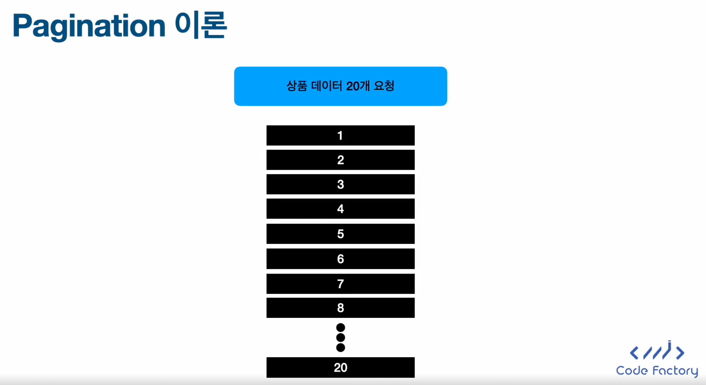
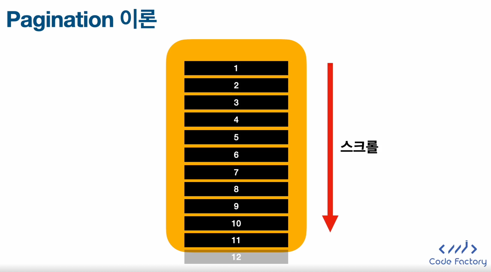
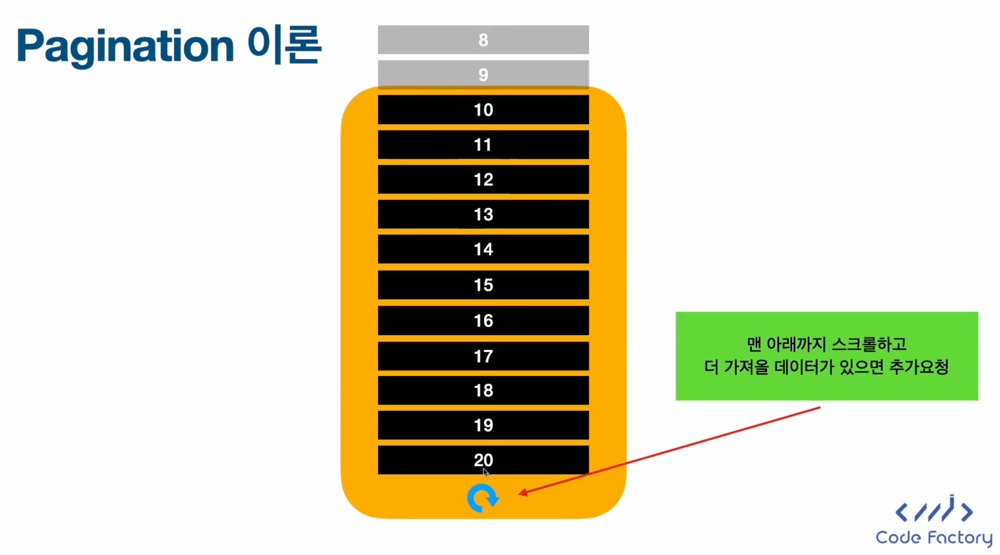
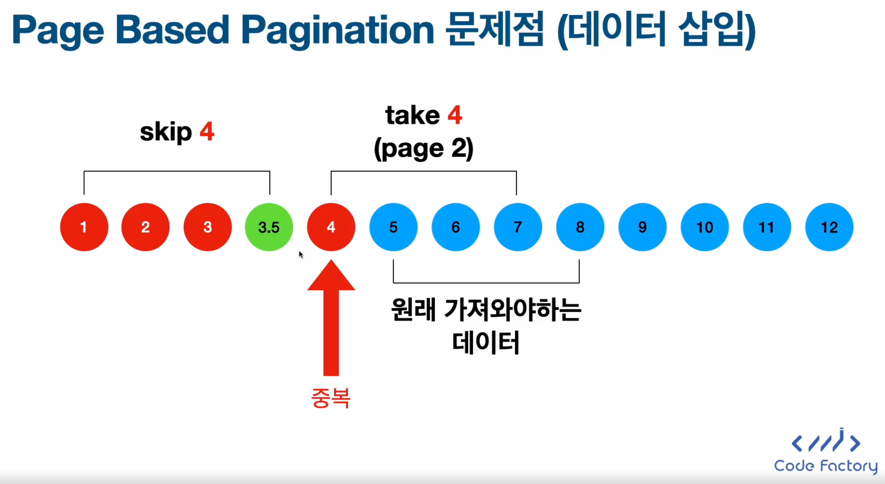
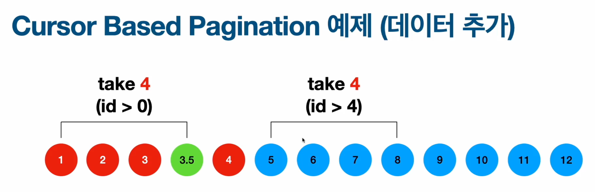

# Pagination
`Pagination`이란 많은 데이터를 부분적으로 나눠서 불러오는 기술이다.

## Pagination의 특징
- **쿼리에 해당되는 모든 데이터를 한 번에 다 불러오지 않고 부분적으로 쪼개서 불러온다.**
- 쿠팡같은 앱의 경우 수억개의 상품이 데이터 베이스에 저장되어 있는데 사용자가 상품검색 화면을 들어갈 때마다 모든 상품 정보를 서버에서 클라이언트로 전송할 필요가 없다.
- 현재 클라우드 시스템은 데이터 전송에 돈이 든다!
- 돈이 안들더라도 수억개의 데이터를 한 번에 보내면 분명 메모리가 터질 것이다!
- 메모리가 터지지 않더라도 데이터 전송에 상당히 오랜 시간이 걸릴 것이다!

## Pagination 이론 

Pagination 도식화 그림

### Page Based Pagination
- `페이지 기준으로 데이터를 잘라서 요청`하는 Pagination
- 요청을 보낼 때 원하는 데이터 갯수와 몇 번째 페이지를 가져올지 명시
- 페이지 숫자를 누르면 다음 페이지로 넘어가는 형태의 UI에서 많이 사용
- `Pagination 도중에 데이터베이스에서 데이터가 추가되거나 삭제될 경우 저장되는 데이터가 누락되거나 중복될 수 있음`
- Pagination 알고리즘이 매우 간단함

#### Page Based Pagination의 단점

### Cursor Based Pagination
- 가장 최근에 가져온 데이터를 기준으로 다음 데이터를 가져오는 Pagination
- 요청을 보낼 때 `마지막 기준값(ID등 Unique한 값`과 `몇 개의 데이터`를 가져올지 명시
- `스크롤 형태의 리스트`에서 자주 사용
- 최근 데이터의 기준값을 기반으로 쿼리가 작성되기 때문에 데이터가 누락되거나 중복될 확률이 적음

#### Cursor Based Pagination 예제
