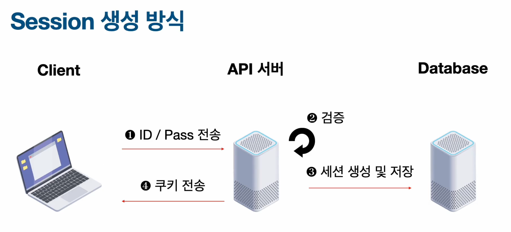
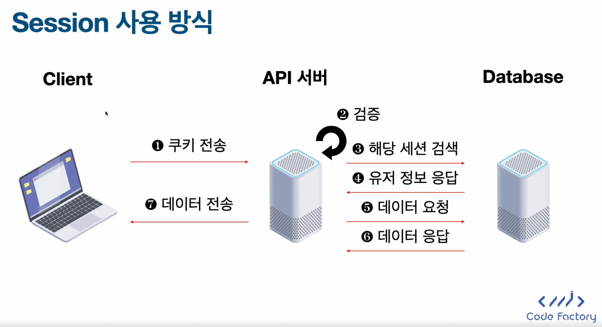
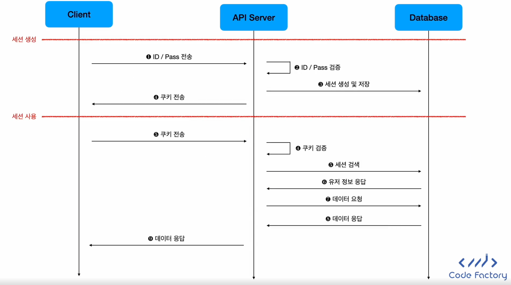
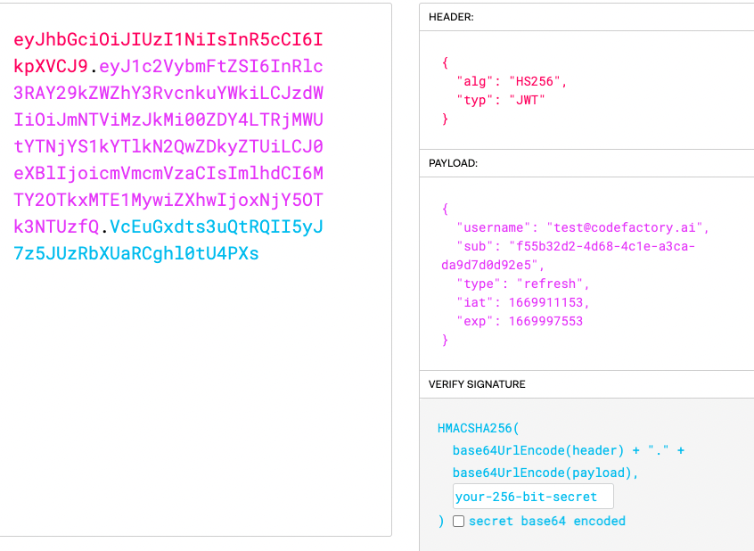

# Session And Token

```mdx-code-block
import Tabs from '@theme/Tabs';
import TabItem from '@theme/TabItem';
```

## Session

<Tabs>
  <TabItem value="Session 생성">
    
  </TabItem>
  <TabItem value="Session 사용">
    
  </TabItem>
  <TabItem value="Flow Chart">
    
  </TabItem>
</Tabs>

<!--
<Tabs>
    <TabItem value="Session 생성">

    
        
    </TabItem>

    <TabItem value="Session 사용">

    
        
    </TabItem>

    <TabItem value="Flow Chart">

    
        
    </TabItem>
</Tabs> 
-->

### Session의 특징
1. Session은 특수한 ID 값으로 구성되어 있다.
2. Session은 **서버에서 생성**되며 **클라이언트에서 쿠키를 통해 저장**된다.
3. 클라이언트에서 요청을 보낼 때 Session ID를 같이 보내면 현재 요청을 보내는 사용자가 누구인지 서버에서 알 수 있다. (요청마다 매번 아이디와 비밀번호를 물어볼 필요가 없음)
4. Session ID는 데이터베이스에 저장되기 때문에 요청이 있을 때마다 데이터 베이스를 확인해야 한다.
5. 서버에서 데이터가 저장되기 때문에 클라이언트에 사용자 정보가 노출될 위험이 없다.
6. 데이터 베이스에 Session을 저장해야하기 때문에 **Horizontal Scaling**이 어렵다.

:::tip Horizontal Scaling?
서버에서 부하를 분산하기 위해서 서버를 수평적으로 확장하는 것을 뜻한다.
:::

## Token 
유저의 정보를 Base 64로 인코딩된 String 값에 저장하는 도구를 뜻한다.

<Tabs>
  <TabItem value="Token 생성 방식">
    
  </TabItem>
  <TabItem value="Token 사용 방식">
    
  </TabItem>
  <TabItem value="Flow Chart">
    
  </TabItem>
</Tabs>

### Token의 특징
1. Tokend은 Header, Payload, Signature로 구성되어 있으며 **Base 64로 인코딩** 되어 있다.
2. Token은 서버에서 생성되며 클라이언트에서 저장된다. (Session이랑 동일)
3. 클라이언트에서 요청을 보낼 때 Token ID를 같이 보내면 현재 요청을 보내는 사용자가 누구인지 서버에서 알 수 있다. (요청마다 매번 아이디와 비밀번호를 물어볼 필요 없음) (Session이랑 동일)
4. Token은 **데이터베이스에 저장되지 않고 Signature 값을 이용해서 검증**할 수 있다. 그래서 검증할 때마다 데이터베이스를 매번 들여다 볼 필요가 없다.
5. 정보가 모두 토큰에 담겨있고 클라이언트에서 토큰을 저장하기 때문에 **정보 유출의 위험**이 있다.
6. 데이터베이스가 필요없기 때문에 Horizontal Scaling이 쉽다.


## Session Vs Token 비교 

| 비교 요소 | Session | Token | 
| --- | --- | --- |
| 유저 정보 저장 위치 | 서버 | 클라이언트 |
| 클라이언트에서 서버로 보내는 정보는? | 쿠키 | 토큰 |
| 유저 정보를 가져올 때 데이터베이스를 확인해야 하는가? | O | X |
| 클라이언트에서 인증 정보를 읽을 수 있는가? | 불가능 | 가능 | 
| Horizontal Scaling이 쉬운가? | 어려움 | 쉬움 |

## JWT란?
- Json Web Tokeno의 약자로 **세션과 토큰을 합친 것**이다.
- Header, Payload, Signature로 구성되어 있으며 **Base 64로 인코딩** 되어 있다.
- Header는 토큰의 종류와 암호화 알고리즘 등 토큰에 대한 정보가 들어있다.
- Payload는 발행일, 만료일, 사용자 ID 등 사용작 검증에 필요한 정보가 들어있다.
- `Signature`는 `Base64 인코딩된 Header와 Payload를 알고리즘으로 싸인한 값`이 들어있다. 이 값을 기반으로 토큰이 발급된 뒤로 조작되었는지 검증할 수 있다.

<Tabs>
  <TabItem value="JWT 예시">
    
  </TabItem>
  <TabItem value="JWT TO JSON">
    
  </TabItem>
</Tabs>

### Refresh Token & Access Token
- 두 Token ahen JWT 기반이다.
- Access Token은 API 요청을 할 때 검증용 토큰으로 사용된다.
- Refresh Token은 Access Token을 갱신하기 위한 토큰이다.
- Access Token은 만료 시간이 짧고 Refresh Token은 만료 시간이 길다.
- 상대적으로 노출이 적은 Refersh Token의 경우 Access Token을 새로 발급받을 때만 사용되기 때문에 탈취 가능성이 적다.

#### Token 사용 과정

<Tabs>
  <TabItem value="토큰 발급 과정">
    
  </TabItem>
  <TabItem value="Refresh Token 사용 과정">
    
  </TabItem>
  <TabItem value="Access Token 사용 과정">
    
  </TabItem>
  <TabItem value="전체 토큰 생성 로직">
    
    <div>전체 토큰 생성 로직은 Access Token이 만료 되었을 경우 Refresh Token을 이용해 새로운 Access Token을 발급받는 과정을 포함하고 있기 때문에 좀 더 복잡할 수 있다.</div>
  </TabItem>
</Tabs>

:::note
- Basic : 실제 인증 정보 사용 (아이디/패스워드)
- Bearer : 토큰 사용
:::

#### Refresh Token 예제

:::note
- iat : 발급 시간
- exp : 만료 시간
:::

### Reference
[JWT Token Test Site](https://jwt.io/)
