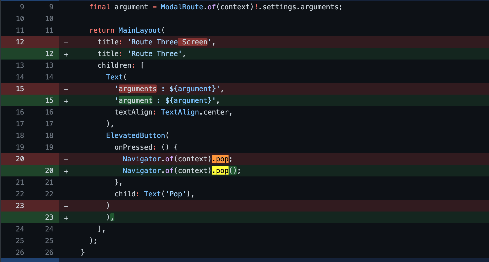

# Navigation
## Push 
Button의 onPressed 함수 내부에 넣어서 동작
### MaterialPageRoute
```dart
ElevatedButton(
	onPressed: () async {
	  // result에는 push된 스크린에서 pop 할 때 인자로 보내주는 값이 들어가게 됨.
	  // 이 때 push를 해주고 pop에서 값을 받을 때까지 기다려야 하기 때문에 await을 사용해줘야 함.
	  final result = await Navigator.of(context).push( // result에 pop에서 보낸 값이 저장되게 됨.
		MaterialPageRoute(
		  builder: (BuildContext cotnext) => routeScreenClass( // push 해줄 screen class 
			constructor: contructorData, // push로 값을 보내는 경우는 costructor로 보냄.
		  ),
		), 
	  );
	},
	child: Text('Push'))
```
#### Named Push 
```dart
// routes의 key값을 전달해주면 됨.
Navigator.of(context).pushNamed('/',arguments: data); // root route
```
### Arguments를 이용해서 Push할 때 값 전달하기
```dart
ElevatedButton(
  onPressed: () {
	Navigator.of(context).push(
	  MaterialPageRoute(
		  builder: (BuildContext context) => routeScreenClass(), // push 해줄 screen class
		  // push의 Setting을 통해서 다른 스크린에 값을 전달 해줄 수 있음.
		  settings: RouteSettings(arguments: data)),
	);
  },
  child: Text('Push'),
```
- 값을 받는 Screen :

```dart
final argument = ModalRoute.of(context)!.settings.arguments; // 반드시 값을 받을 때 
final? argument = ModalRoute.of(context).settings.arguments; // 값이 없을 수도 있을 때 
```

### Push Replacement
현재 Route를 대체해서 Push를 함. 즉, 현재 Route Pop > builder Screen Push 이런식으로 동작 됨. <br></br>
arguments 필요하다면 일반적인 Push와 마찬가지로 constructor에 전달해주면 됨.
```dart
ElevatedButton(
  onPressed: () {
				Navigator.of(context).pushReplacement(
	  MaterialPageRoute(
		builder: (_) => routeScreenClass(), // push할 screen 
	  ),
	);
  },
  child: Text('Push Replacement')),
```
#### Push Named Replacement
```dart 
ElevatedButton(
  onPressed: () {
	Navigator.of(context).pushReplacementNamed('/', arguments: data, ); // root route
  },
  child: Text('Push Replacement')),
```

### Push And Remove Until 
true 값을 반환해주는 Route 빼고 전부 Stack에서 삭제해줌(자세한 설명 소스코드 참조).
```dart
ElevatedButton(
  onPressed: () {
	Navigator.of(context).pushAndRemoveUntil(
		MaterialPageRoute(builder: (_) => RouteThreeScreen()),
		// False가 전달이 되면 Stack에 있는 모든 Route들이 다 삭제됨.
		// true 값을 넘겨주면 모든 Route들이 살아있게 됨.
		// 아래와 같이 route.settings.name에 해당하는 route key값을 넘겨주게 되면 해당 route만 true가 됨.
		// 즉, 해당 route를 제외한 모든 route들은 Stack에서 지워짐.
		(route) => route.settings.name == '/');
  },
  child: Text('Push And Remove Until')),
```
#### Push Named And Remove Until
```dart
ElevatedButton(
  onPressed: () {
	Navigator.of(context).pushNamedAndRemoveUntil('/three',(route) => route.settings.name == '/');
  },
  child: Text('Push Named And Remove Until')),
```

## pop
```dart
ElevatedButton(
	onPressed: () {
		// Push 해준 부분으로 return 값을 보내줌

		Navigator.of(context).pop(return data); 	
		},
	child: Text('Pop'))
  ],
),
```

### mayPop
Stack에 Pop 가능한 Screen이 있어야지만 Pop 해줌.
```dart
Navigator.of(context).maybePop();
```

### WillPopScope
안드로이드에서 최상단에 기본적으로 뒤로가기를 할 수 있는 버튼이 있음. 최상단에서 이 뒤로가기 버튼을 누르게되면 앱을 나가게 되는 이를 방지해줌. 
```dart
WillPopScope(
  onWillPop: () async {  // async 꼭 사용해줘야 함.
	// 여기에 false를 return 해주게 되면 최상단에서 뒤로가기 Button으로 앱을 빠져나갈 수 없게 됨.
	return false;
  },
```
[참조](https://github.com/rookedsysc/Flutter-Study/commit/44a9d2199d72155a931397fa49dd1611a4fb041e)

### canPop
Pop 동작은 하지 않고 Stack에 어떤 값이 있는지 확인하는 용도.
```
print(Navigator.of(context)
	.canPop()); // 아무런 pop 동작도 하지 않고 return만 주는 역할.
```


## Error Fix
### Pop Error
return 값 없다고 () 안써주면 pop이 동작을 안함.<br></br>


## Reference
[참조](https://github.com/rookedsysc/Flutter-Study/tree/main/Theory/navigation/lib)
