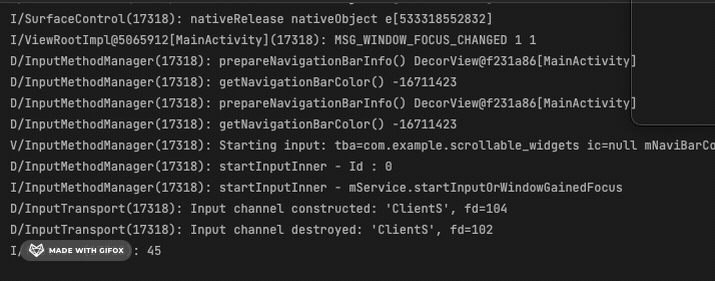
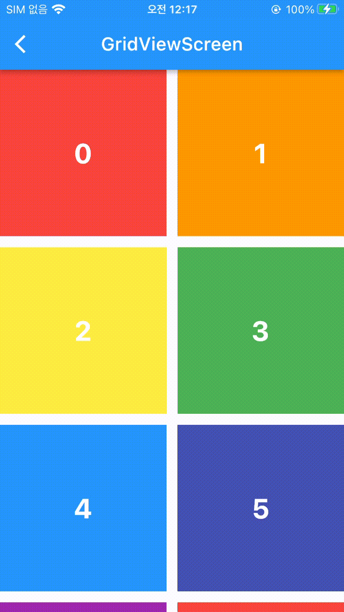
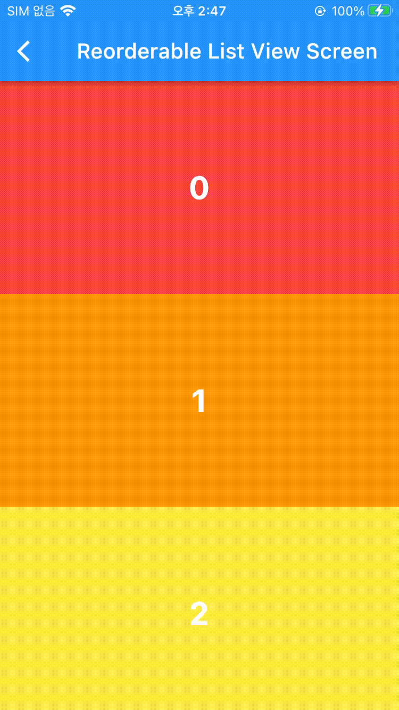

# Scrollable Widget

```mdx-code-block
import Tabs from '@theme/Tabs';
import TabItem from '@theme/TabItem';
```

## Single Child Scroll View
기본은 스크롤이 안되지만, 화면이 길어지면 Scroll이 가능함.<br></br>
뷰를 호출할 때 전체 리스트를 한꺼번에 불러온다는 문제점이 있음. 이는 성능 이슈로 이어질 수 있음.

<Tabs>
<TabItem value="소스코드">

```dart
SingleChildScrollView(
  child: Column(
    children:
        rainbowColors.map((e) => RenderColorContainer(color: e)).toList(),
  ),
)
```

</TabItem>
<TabItem value="실행결과">
<div style={{textAlign: "center"}}>

</div>
</TabItem>
</Tabs>


### physics: 스크롤 스타일 
개체가 화면을 넘어가지 않으면 scroll이 불가능 하지만 이를 억지로 가능하게 해주는 방법도 있음. 
```dart
SingleChildScrollView(
  /* 
    Single Child ScrollView가 어떤 방식으로 작용하는지 정할 수 있음.
    AlwaysScrollableScrollPhysics() - 항상 스크롤 가능
    NeverScrollableScrollPhysics()- 절대 스크롤 불가능
    BouncingScrollPhysics() - iOS Style (튕김.)
    ClampingScrollPhysics() - Android Style (튕기지 않음.)
  */
  physics: AlwaysScrollableScrollPhysics(),
  child: Column(
    children: [
      RenderColorContainer(color: Colors.black),
    ],
  ),
);
```

<div style={{textAlign: 'center'}}>

</div>

#### PageScroll 
말로 설명하자면 어려운데 책장 넘기듯이 다음 페이지로 넘어가게끔 해주는 기능, 중간에 걸리거나 그러지 않고 다음 List로 넘어감.
```dart
physics: PageScrollPhysics(), 
```

<Tabs>
<TabItem value="적용 전">
<div style={{textAlign: "center"}}>

</div>
</TabItem>
<TabItem value="적용 후">
<div style={{textAlign: "center"}}>

</div>
</TabItem>
</Tabs>


### clipBehavior: 화면 잘림
위에서 보면 화면이 스크롤 될 때 잘리는 것을 볼 수 있음. 이는 clipBehavior 속성을 추가해서 해결할 수 있음.
```dart
clipBehavior: Clip.none
```
전체 적용 👇
```dart
SingleChildScrollView(
  physics: AlwaysScrollableScrollPhysics(),
  // Clip.none : 화면 잘리지 않게 해줌.
  clipBehavior: Clip.none,
  child: Column(
    children: [
      RenderColorContainer(color: Colors.black),
    ],
  ),
);
```

<div style={{textAlign: "center"}}>

</div>

## List View
모든 뷰를 한 번에 보여주는 방법, 기본적인 사용 방법이지만 이는 위의 Single Child List View와 같이 성능 이슈로 이어질 가능성이 있음.
```dart
ListView (
  children: [
  ]
)
```

<div style={{textAlign: "center"}}>

</div>


### Builder: Build되는 View만 생성
Build 되는 View만 생성하므로 성능 이슈 안정화.<br></br>

```dart
ListView.builder(
  itemCount: 100,
  itemBuilder: (context, index) {
    print(index); // 새로운 뷰가 호출될 때마다 생성
    return RenderColorContainer(
      color: rainbowColors[index % rainbowColors.length],
      index: index,
    );
  },
);
```

### seperate: 사이사이에 view 생성
```dart
ListView.separated(
  itemBuilder: (context, index){
    return RenderColorContainer(
      // 랜더하고 싶은 뷰
      color: rainbowColors[index % rainbowColors.length]);   
    }, 
  separatorBuilder: (context, index){
    return RenderColorContainer(
      // 사이사이에 렌더하고 싶은 뷰
      color: Colors.black, 
      height: 50,
      );
    }, itemCount: 100);
```

<div style={{textAlign: "center"}}>

</div>


### ListTile
[텍스트 또는 아이콘을 포함하는 고정 높이의 단일 행.](https://api.flutter.dev/flutter/material/ListTile-class.html)

<Tabs>
<TabItem value="소스코드">

```dart
ListTile(
  tileColor: Colors.white,
  selectedTileColor: lightColor,
  selectedColor: Colors.black,
  selected: e == '서울',
  onTap: () {},
  title: Text(e), // e: 도시 이름
), 
```

</TabItem>
<TabItem value="실행결과">
    <div style={{textAlign: "center"}}>
    
    </div>
</TabItem>
</Tabs>

## Grid View
가로로 여러 개의 View를 표시할 수 있음.
### Count 
뷰를 한 번에 다 그려낸다는 단점이 있음.
```dart
crossAxisCount 
```
에 가로로 표시될 뷰의 갯수를 넣어줄 수 있음. 전체 코드 👇
```dart
GridView.count(
  crossAxisCount: 2, // 가로 뷰 갯수
  crossAxisSpacing: 12.0, // 가로 간격
  mainAxisSpacing: 12.0, // 가로 간격
  children: numbers
      .map(
        (e) => RenderColorContainer(
      color: rainbowColors[e % rainbowColors.length],
      index: e,
    ),
  ).toList(),
);
```




#### AxisSpacing
- crossAxisSpacing : 가로로 간격 나눔 (float)
- mainAxisSpacing : 세로로 간격 나눔 (float)

### builder: 화면에 보이는 갯수만큼
#### (delegate)CrossAxisCount: 지정한 갯수 기준
가로로 지정한 갯수만큼 뷰를 보여줌.
```dart
GridView.builder(
  gridDelegate: GridDelegateWithFixedCrossAxisCount( 
      crossAxisCount: 2 // 가로로 뷰 갯수 고정함
  ),
  itemBuilder:(context, index) {
    return RenderColorContainer(
      color: rainbowColors[index % rainbowColors.length],
      index: index,
    );
  },
);
```

#### (delegate)CrossAxisEntent: 최대 사이즈 기준
지정한 최대 크기 기준으로 그 최대 크기를 넘지 않는 선에서 가로로 최대로 뷰 갯수를 채움.
```dart
gridDelegate: SliverGridDelegateWithMaxCrossAxisExtent(
  maxCrossAxisExtent: 50, // 최대 크기가 50이 되는 한도 내에서 가로로 꽉 채움.
)
```


## Reorderable List View 
재정렬 가능한 List View.
builder를 통한 구현 👇
```dart
ReorderableListView.builder(
  itemBuilder: (context, index) {
    return RenderColorContainer( 
        key: Key(
          index.toString()), 
          color: rainbowColors[renderNumbers[index] % rainbowColors.length], 
          index: renderNumbers[index]);// (1)!
  },
  itemCount: renderNumbers.length,
  onReorder: (int oldIndex, int newIndex) {
    setState(() {
      if (oldIndex < newIndex) {
        newIndex -= 1;
      } // (2)!
      final item = renderNumbers.removeAt(oldIndex);
      renderNumbers.insert(newIndex, item);
    });
  },
)
```

1. index number가 이동하면 이동한 위치의 새로운 index number(3 > 5로 옮기고 나면 3자리에 3이 그대로 들어옴)가 됨, 그러나 해당 index에 있던 renderNumber는 바뀌게 됨(3자리에 있던 3을 5로 보내게 되면 3자리에 4가 들어옴). <br></br><br></br>
즉, 3에 있던 renderNumber를 5로 보내면 여전히 3번째 인덱스를 봤을 때 3번째 인덱스로 보이지만 해당하는 인덱스에는 renderNumber의 다음 인덱스가 그 인덱스 번호를 차지하게 됨.
2.  oldIndex와 newIndex 모두 이동이 되기 전에 산정됨. <br></br><br></br>
[red, orange, yellow] <br></br>
[0, 1, 2] <br></br><br></br>
red를 yellow 다음으로 옮기고 싶을 경우 <br></br>
oldIndex는 0으로 newIndex는 3으로 지정이 됨. <br></br>
[orange, yellow, red] <br></br>
옮기고 난 후의 Red의 index는 2번이 됨. <br></br>
따라서 낮은 인덱스를 높은 인덱스로 옮길 때는 newIndex에 -1을 해줘야함. <br></br><br></br>
[red, orange, yellow]<br></br>
yellow를 맨 앞으로 옮기고 싶을 경우. <br></br>
yellow : 2 oldIndex -> 0 newIndex <br></br>
[yellow, red, orange] <br></br>





## Custom Scroll View
Grid View와 List View를 연속해서 써야할 일이 있거나할 때 Custom해서 사용자가 정의한 방식대로 동작하는 Scroll View.
### Sliver List
```dart
@override
Widget build(BuildContext context) {
  return Scaffold(
    body: CustomScrollView(
      slivers: [
        renderSliverAppBar(),
        renderBuilderSliverList(),
      ],
    ),
  );
}

SliverList renderBuilderSliverList() {
  return SliverList(
    delegate: SliverChildBuilderDelegate( // delegate 지정해줘야함.
    (context, index) {
        return RenderColorContainer(
            index: index,
            color: rainbowColors[index % rainbowColors.length]);
      },// (1)!
      childCount: 100, // itemCount와 같음, view 최대 갯수 지정
    ),
  );
}
```

1. ListView에서는 itemBuilder의 파라미터로 들어갔지만 여기에선 Delegate에 함수 형태로 들어가게 됨.

### Sliver Grid
Sliver List에서 gridDelegate가 추가됨.
```dart
Widget build(BuildContext context) {
  return Scaffold(
    body: CustomScrollView(
      slivers: [
        renderSliverAppBar(),
        renderSliverGrid(),
      ],
    ),
  );
}

SliverGrid renderSliverGrid() {
  return SliverGrid(
    delegate: SliverChildBuilderDelegate(
          (context, index) {
        return RenderColorContainer(
            index: index,
            color: rainbowColors[index % rainbowColors.length]);
      },
      childCount: 100, // itemCount와 유사함
    ),
    // Grid View에서 추가하는 Delegate에 Sliver만 붙임.
    gridDelegate: SliverGridDelegateWithFixedCrossAxisCount(crossAxisCount: 2), 
  ); 
} 
```

### Sliver Appbar
커스텀 Appbar, Default 설정으로 자동으로 없어지게 끔 되어 있음.

<Tabs>
<TabItem value="소스코드">

```dart
SliverAppBar(
    // true로 하면 위로 잠깐 스크롤했을 때 AppBar 나타남.
    floating: true,   
    // true시 조금만 스크롤해도 AppBar 움직임.
    snap: false,

    stretch: true, 
    pinned: false, 

    expandedHeight: 400, // 최대로 늘어나는 사이즈
    collapsedHeight: 100, // 접혔을 때 사이즈

    flexibleSpace: FlexibleSpaceBar(
    background: Image.asset(
        'asset/img/image_1.jpeg',
        fit: BoxFit.cover
    ),
    title: Text(
        'FlexibleSpaceBar',
        style: TextStyle(color: Colors.black),
        ),
    ), 
    title: Text('Custom Scroll View Screen'),
);
```

</TabItem>
<TabItem value="stretch">
<div style={{textAlign: "center"}}>
stretch_false / stretch_true<br></br>


</div>
</TabItem>
<TabItem value="flexible space">
<div style={{textAlign: "center"}}>

</div> 
</TabItem>
</Tabs>

### Sliver Header
Sliver Header는 Custom Scroll View 사이사이에 Header를 넣을 수 있는 기능임. <br></br>

<Tabs>
<TabItem value="소스코드">

```dart title="SliverPersistentHeader"
SliverPersistentHeader(
  pinned: true, // 상단에 고정함
  // Delegate에서 실제 동작 구현 
  delegate: _SliverFixedHeaderDelegate(
    child: Container(
        color: Colors.black,
        child: Center(
          child: Text(
            '신기하지~',
            style: TextStyle(
              color: Colors.white,
            ),
          ),
        ),
      ),
      maxHeight: 200,
      minHeigt: 10),
);
```

</TabItem>
<TabItem value="실행화면">
<div style={{textAlign: "center"}}>

</div>
</TabItem>
</Tabs>

```dart title="Delegate Class (실제로 동작하는 부분)"
class _SliverFixedHeaderDelegate extends SliverPersistentHeaderDelegate {
  final Widget child;
  final double maxHeight;
  final double minHeigt;

  _SliverFixedHeaderDelegate({
    required this.child,
    required this.maxHeight,
    required this.minHeigt,
  });

  // 실제로 build 하는 부분
  @override
  Widget build(
      BuildContext context, double shrinkOffset, bool overlapsContent) {
    return SizedBox.expand(
      child: child,
    );
  }

  // 최대 높이
  @override
  double get maxExtent => maxHeight;

  // 최소 높이
  @override
  double get minExtent => minHeigt;

  // oldDelegate - build가 실행이 됐을 때 이전 Delegate
  // return 값이 true면 재빌드 함
  @override
  bool shouldRebuild(_SliverFixedHeaderDelegate oldDelegate) {
    return oldDelegate.minHeigt != minHeigt ||
        oldDelegate.maxHeight != maxHeight ||
        oldDelegate.child != child;
  }
}
```

### Sliver To Box Adaptor
`slivers = [] 안`에는 `Sliver 위젯`들 밖에 들어올 수 없지만 `Sliver To Box Adaptor`를 사용하면 일반 위젯도 들어올 수 있음.

```dart title="Slvier To Box Adaptor"
SliverToBoxAdapter(
  child: Container(
    color: Colors.white,
    height: 200,
    child: Column(
      mainAxisAlignment: MainAxisAlignment.center,
      children: [
        Text(
          '이건 되지롱 !!!!!',
          style: TextStyle(fontSize: 18, fontWeight: FontWeight.w700),
          textAlign: TextAlign.center,
          
        ),
      ],
    ),
  ),
);
```

## Scrollbar  
Scroll 가능한 위젯을 Widget(Scrollbar)로 감싸줌. 기본적으로 존재하지 않는 스크롤 바가 생김.

<Tabs>
<TabItem value="소스코드">

```dart
Scrollbar( 
  child: SingleChildScrollView(
    child: Column(
      children: renderNumbers
          .map(
            (e) => RenderColorContainer(
              index: e,
              color: rainbowColors[e % rainbowColors.length],
            ),
          )
          .toList(),
    ),
  ),
),
```

</TabItem>
<TabItem value="실행결과">
<div style={{textAlign: "center"}}>

</div>
</TabItem>
</Tabs>


## Refresh Indicator
Scrollable View의 최상단에서 아래로 당겼을 때 loading 창이 구현됨.<br></br>
ScrollBar와 마찬가지로 Scrollable 위젯을 Refresh Indicator로 감싸고 onRefresh로 refresh 실행시 동작할 함수를 구현함.

<Tabs>
<TabItem value="소스코드">

```dart
RefreshIndicator(
  // refresh 실행하면 실행될 함수 
    onRefresh: () async {
    await Future.delayed(Duration(seconds: 2));
  },
  child: ListView(
    children: renderNumbers.map(
      (e) => RenderColorContainer(
        index: e,
        color: rainbowColors[e % rainbowColors.length],
      ),
    ).toList(),
  ),
);
```

</TabItem>
<TabItem value="실행결과">
<div style={{textAlign: "center"}}>

</div>
</TabItem>
</Tabs>