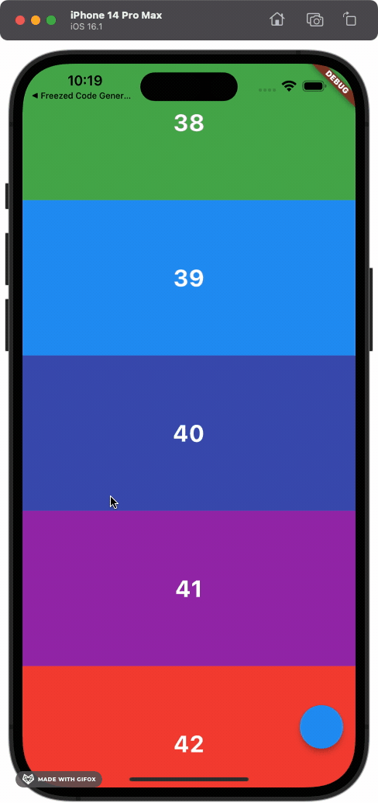

# Move To Top
Scrollable Widget에서 어떠한 Button을 눌렸을 때 (최상단으로 이동하기 등) 특정 위젯으로 이동하기 위해서 구현. 

## Key 활용하는 방식

### Key 선언
```dart
GlobalKey customContainerKey = GlobalKey();
```

### 위젯에 Key 넣어주기 
인덱스가 0번인 위젯(최상단에 위치하는 위젯)에 key값 넣어줌.
```dart
Container(
  key: index == 0 ? customContainerKey : Key(index.toString()),
  height: height ?? 200,
  color: color,
  child: Center(
    child: Text(
      index.toString(),
      style: const TextStyle(
          color: Colors.white,
          fontWeight: FontWeight.w700,
          fontSize: 30.0),
    ),
  ),
);
```

### 위젯으로 이동하기 구현
Scrollable.ensureVisible에 원하는 위젯의 key 값을 넣어주면 해당하는 key 값을 들고 있는 위젯으로 이동함.


<Tabs>
  <TabItem value="Floating Action Button">

```dart title="Floating Action Button"
floatingActionButton: FloatingActionButton(onPressed: () { // (1) 실행 결과
  Scrollable.ensureVisible(customContainerKey.currentContext!);
},
```

  </TabItem>
  <TabItem value="banana" label="Banana">
    This is a banana 🍌
  </TabItem>
</Tabs>

0. 

### 참조

[Move To Top Floating Button/main.dart](https://github.com/rookedsysc/Flutter-Study/blob/main/Theory/move_to_top_floating_button/lib/main.dart)
