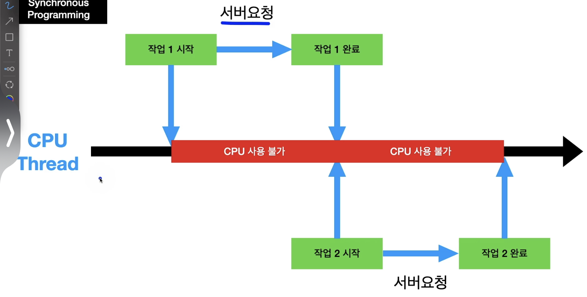
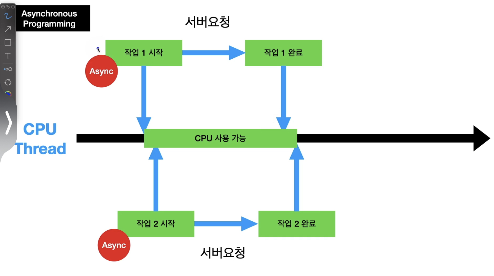
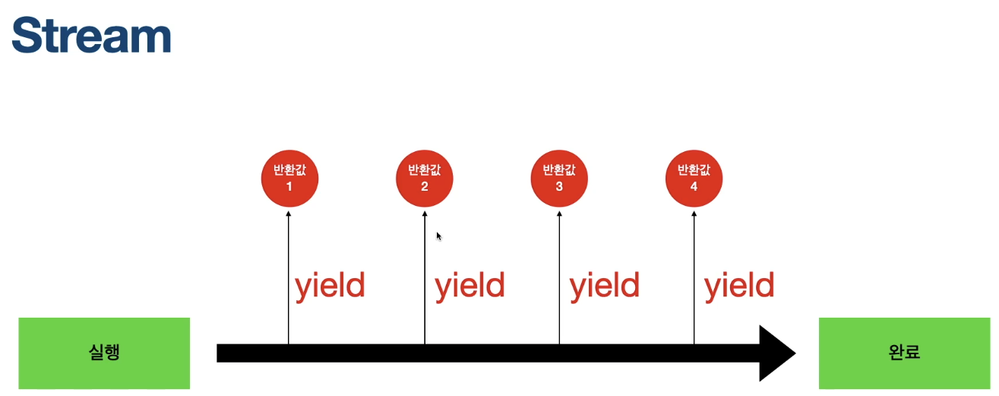

# 비동기 프로그래밍
## Async Programming
기존의 cpu의 동작은 실행한 코드가 있으면 해당 코드가 실행이 될 때까지 다음 동작을 실행할 수 없었음.<br></br>
이는 http 요청 같은 작업을 할 때 문제가 발생하는데, 서버에서 요청값을 받아오기 전까지 cpu가 수행할 수 있는 동작이 아무것도 없어진다는 문제점이 발생함.<br></br>
다음은 기존 cpu의 동작 방식 👇<br></br>
<br></br><br></br>
이를 해결하기 위해서 등장한 방식이 바로 Async Programming인데, **비동기 프로그래밍**이라고도 불리며 현재 실행중인 동작이 완료되지 않더라도 다음 동작을 실행하는 것을 뜻함.<br></br>
<br></br>

## Future and await
Future 데이터 타입으로 정의할 수 있으며, Future 관련 method 등을 써줄 수 있음.<br></br>
```dart
Future<returnType> functionName(Parameter1, Parameter2...) async {
```
### Future.delayed
첫 파라미터에는 지연할 기간(얼마나 지연할건지) Duration 값을 넣어주고 두 번째 파라미터에는 지연시간이 지난 후 실행할 함수를 넣어줌.
```dart
Future.delayed(Duration(seconds: ), () {}
```
### await 
await을 사용하기 위해선 함수에다가 async를 추가해야지 사용할 수 있음. 
```dart
void main() async {
	await 실행할함수();
}
```
### then과 WhenComplete
then은 오류가 있을 경우에 실행을 안하고 WhenComplete은 오류가 있을 경우에도 실행을 함.
```dart 
void main() async {
  await futureAsync().then((value) {
    print("Then"); // 출력 안됨
  }).whenComplete(() {
    print("WhenComplete"); // 출력
  });
}

Future futureAsync() async {
  return Future.error("error");
}
```

### ConnectionState
FutureBuilder의 처리 상태에 따라서 어떤 조건을 넣고 수행해줄 수 있음.<br></br>

- 아래와 같은 형태로 사용함.

```dart 
snapshot.connectionState
```

- State의 종류 

```dart
enum ConnectionState {
	none, // Future 상태가 없음.
	waiting, // Future 실행 후 로딩 중.
	// Stream에서 하나 이상의 return 값을 반환 했지만 아직 완전히 끝나지 않았을 때	
	active, 	
	done, // Future 실행 완료.
}
```

#### Future 병렬로 데이터 처리하기
Future들을 List에 넣어준 뒤 List를 한꺼번에 .wait()해서 데이터를 받아줌.<br></br>
Future를 하나하나 실행시키고 기다리는 것이 아닌, Future를 모두 동시에 실행시키고 전부 끝날 때까지 기다려서 시간을 단축시킬 수 있음.
```dart
List<Future> futures = [];

for(ItemCode itemCode in ItemCode.values) {
  futures.add(
    StatRepository.fetchData(
    itemCode: itemCode,
    ),
  );
}
// futures에 들어있는 모든 Future이 실행될 때까지 기다림
// 해당 Future 실행결과 값, 즉, List<StatModel>이 들어감
final results = await Future.wait(futures);
```

#### Future and await 참조
[Future and await 참조 1](https://github.com/rookedsysc/Flutter-Study/blob/main/Grammar/asyncProgramming/future.dart)<br></br>
[Future and await 참조 2](https://github.com/rookedsysc/Flutter-Study/blob/main/Grammar/asyncProgramming/await.dart)


### Stream
리스너를 생성해서 리스너가 리스닝을 하고 있는 동안 controller가 값을 넣어주면 함수가 실행됨. <br></br>
이 때 return 되는 값들을 지속적으로 반환해줌.<br></br>

```dart
StreamBuilderBuilder<generic> {
	stream: 실행할 함수
}

Stream<generic> 실행할 함수() async* {
	yield 반환 값;
}
```

### aysnc*
stream을 사용할 때 사용해줘야 하는 키워드, 연산을 미리 다 하는게 아니라, 요청이 있을 때까지 기다리다가 요청이 들어오면 그 때 연산을 시작하는 것이라고 함.
### yield
return과 유사한 행위를 하지만 함수를 종료하지 않고 반복되는 return 값들을 전부 return 해줄 수 있음.

### 예시 

```dart
import 'dart:async';

void main() {
  final controller = StreamController();
  // asBroadcastStream을 이용해줘야 여러번 listening을 할 수 있음.
  final Stream = controller.stream.asBroadcastStream();

  // 짝수만 출력
  // 리스너 생성, 이 리스너가 리스닝을 하고 있을 때 값이 들어오면 함수가 실행됨.
  final streamListener1 = Stream.where((val) => val % 2 == 0).listen((val) {
    print('Listener1 : $val');
  });

  // 홀수만 출력
  final streamListener2 = Stream.where((val) => val % 2 == 1).listen((val) {
    print('Listener2 : $val');
  });

  // controller를 통해서 리스너에 값을 넣어줌
  controller.sink.add(1);
  controller.sink.add(2);
  controller.sink.add(3);
  controller.sink.add(4);
}
```

#### Reference
[참조 1](https://github.com/rookedsysc/Flutter-Study/blob/main/Grammar/asyncProgramming/test.dart)<br></br>
[참조 2](https://github.com/rookedsysc/Flutter-Study/blob/main/Grammar/asyncProgramming/test3.dart)<br></br>
[참조 3](https://github.com/rookedsysc/Flutter-Study/tree/main/Theory/future_and_stream_builder)
