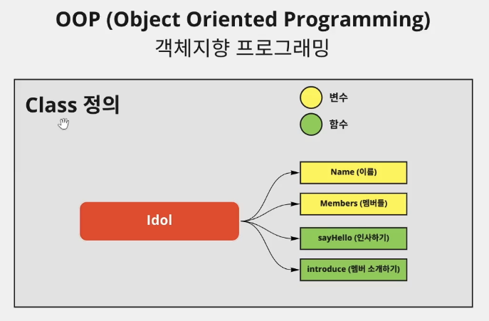

# 객체지향 프로그래밍

```mdx-code-block
import Tabs from '@theme/Tabs';
import TabItem from '@theme/TabItem';
```

## 객체지향 프로그래밍
객체지향 프로그래밍(OOP, Object Oriented Programming)이란? <br></br>
Class의 인스턴스를 생성해서 할당을 해주면 해당하는 인스턴스를 무한히 생성가능.<br></br>

### 객체지향 프로그래밍(OOP)인 이유
class를 기본적으로 생성해주면 hashCode, runtimeType, toString, noSuchMethod 등이 기본적으로 할당이 됨. 이는 class가 생성될 때 **모든 class는 최상위 부모 class로 Object를 가지고 있기 때문**. 그리고 이 Object의 기본적으로 제공이 되는 기능이 저 4가지 기능임.
```dart
void main() {
    Test test = Test();

    // 기본적으로 할당되어 있음
    test.hashCode;
    test.runtimeType;
    test.toString();
    test.noSuchMethod(invocation);
}

class test entends Object{}
``` 

### class 기본형

```dart
void main() {
  Idol blackPink = Idol(
    "블랙핑크",
    ['제니', '지수', '리사', '로제'],
  );

  blackPink.sayHello();
  blackPink.introduce();

  Idol bigBang = Idol( // 일반적인 생성자
    "빅뱅",
    ["권지용", "최승현", "패배", "동영배", "강대성"],
  );
  Idol namedBigBang = Idol.fromList( // nammed 생성자 할당
    [
      ["권지용", "최승현", "패배", "동영배", "강대성"],
      "빅뱅",
    ]
  );
  bigBang.sayHello();
  bigBang.introduce();
  namedBigBang.sayHello();
  namedBigBang.introduce();
}

class Idol {
    String name = "블랙핑크";
    List<String> members = ['제니', '지수', '리사', '로제'];

    void sayHello() {
      print("안녕하세요. ${this.name} 입니다.");
    }
    void introduce() {
      print('저희 멤버는 ${this.members}가 있습니다.');
    }

    /* constructor (생성자)
    this는 현재 class의 프로퍼티를 나타냄 */
    // Idol(String name, List<String> members): this.name = name, this.members = members;
    Idol(this.name, this.members);
    // named constructor
    Idol.fromList(List values):this.members = values[0], this.name = values[1];
}
```

#### Constructor
Constructor는 생성자를 뜻하며 객체지향 언어에서 `객체의 초기화`를 담당하는 서브루틴을 가르킨다. 
[생성자는 객체가 처음 생성될 때 호출되어 멤버 변수를 초기화하고, 필요에 따라 자원을 할당하기도 한다.](https://ko.wikipedia.org/wiki/%EC%83%9D%EC%84%B1%EC%9E%90)
```dart
class Idol {
  String = "블랙핑크";
  List<String> name = ['제니', '지수', '리사', '로제'];

  Idol(this.name, this.members);
  // 위와 아래는 정확하게 같은 동작을 한다. 다만 위는 this를 사용하여 더 간결하게 작성한 것이다.
  // 여기서 this는 현재 class의 프로퍼티를 나타낸다.
  // Idol(String name, List<String> members): this.name = name, this.members = members;
}
```

##### Named Constructor 
named constructor는 전달해주는 property 명을 지정해주는게 아니라 class를 인스턴스화 할 때 클래스 뒤에 어떤 constructor를 사용할지 명시해주는 것이다. <br></br>
```dart
class Employee {
  int empID;
  String empName;

  // 인스턴스화 해서 ID의 값을 넣어줄 때 Emeployee.ID( value )이런 형태로 넣어준다.
  Employee.ID(this.empID); // Named Constructor Creation
  Employee.name(this.empName);
}

main() {
  var myEmployee01 = new Employee.ID(15);
  var myEmployee03 = new Employee.name("rookedsysc");

  print(myEmployee01.empID); // 15
  print(myEmployee03.empName); // rookedsysc
}
```

##### Factory Contsructor
factory는 [항상 새로운 객체를 생성하지 않는 클래스에 사용 한다](https://dart.dev/guides/language/language-tour#factory-constructors)고 써져 있다. 
즉, class를 생성할 때 constructor를 입력 받는게 아니라, 해당 constructor가 필요할 때 입력을 받는 것이다.<br></br>
예를 들어서 factory constructor는 return 값으로 인스턴스를 캐쉬에서 반환하거나(자기 자신을 반환), 자기 자신을 상속받은 자식 class를 반환할 수 있다.
```dart
void main() {
  final parent = Parent(id: 1);
  print(parent.id);

  final child = Child(id: 2);
  print(child.id);

  final parent2 = Parent.fromInt(5);
  print(parent2);
}

class Parent{ 
  final int id;

  Parent({required this.id});
  // 현재 클래스의 인스턴스 뿐만이 아니라 현재 클래스를 상속하는 클래스를 인스턴스화 해서 반환할 수 있음
  factory Parent.fromInt(int id) => Child(id: id);
}

class Child extends Parent{
  Child({required super.id});
}
```
:::tip 이를 통해서 다음과 같이 [.fromJson constructor](https://github.com/rookedsysc/Flutter-Study/blob/main/Project/lv2_actual/lib/restaurant/model/restaurant_model.dart)를 만들 수 있다.
```dart
factory RestaurantModel.fromJson({
    required Map<String, dynamic> json,
  }) {
    return RestaurantModel(
      id: json['id'],
      name: json['name'],
      thumbUrl: 'http://$ip/${json['thumbUrl']}',
      tags: List<String>.from(json['tags']),
      priceRange: RestaurantPriceRange.values
          .firstWhere((e) => e.name == json['priceRange']),
      ratings: json['ratings'],
      ratingsCount: json['ratingsCount'],
      deliveryTime: json['deliveryTime'],
      deliveryFee: json['deliveryFee'],
    );
  }
```
:::


#### immutable 프로그래밍: final
한 번 값을 선언하고 나면 값을 변형할 수 없도록 해줌.<br></br>
```dart
void main() {
  Idol blackPink = Idol(
    "블랙핑크",
    ['제니', '지수', '리사', '로제'],
  );
  // blackPink.name = "아이유"; // error 발생
  blackPink.sayHello();
  blackPink.introduce();
}

class Idol {
  // imutable 프로그래밍 : 선언한 이후에 값을 변경할 수 없도록 해줌.
  final String name;
  List<String> members;

  void sayHello() {
    print("안녕하세요. ${this.name} 입니다.");
  }
  void introduce() {
    print('저희 멤버는 ${this.members}가 있습니다.');
  }

  Idol(this.name, this.members);
}
```
#### immutable 프로그래밍: const
```dart
void main() {
  Idol blackPink = const Idol( // const를 사용할 때는 값을 선언하는 부분에도 const로 변수를 만들어줘야 함
    "블랙핑크",
    ['제니', '지수', '리사', '로제'],
  );
  // blackPink.name = "아이유"; // error 발생
  blackPink.sayHello();
  blackPink.introduce();
}

class Idol {
  final String name;
  final List<String> members;

  void sayHello() {
    print("안녕하세요. ${this.name} 입니다.");
  }
  void introduce() {
    print('저희 멤버는 ${this.members}가 있습니다.');
  }
  // imutable 프로그래밍 : 선언한 이후에 값을 변경할 수 없도록 해줌.
  const Idol(this.name, this.members);
}
```
##### const immutable class의 특수성
같은 class의 인스턴스 프로퍼티를 비교할 때 const로 선언한 class 인스턴스끼리는 값이 같으면 같다고 return 해줌.
```dart
void main() {
  Idol blackPink = Idol( // const를 사용할 때는 값을 선언하는 부분에도 const로 변수를 만들어줘야 함
    "블랙핑크",
    ['제니', '지수', '리사', '로제'],
  );
  Idol blackPink2 = Idol(
    "블랙핑크",
    ['제니', '지수', '리사', '로제'],
  );
  Idol bigBang = const Idol (
    "빅뱅",
    ['GD', 'TOP', '대성', '태양', '패배'],
  );
  Idol bigBang2 = const Idol (
    "빅뱅",
    ['GD', 'TOP', '대성', '태양', '패배'],
  );
  print(blackPink == blackPink2); // false 출력
  print(bigBang == bigBang2); // true 출력 (const로 선언한 class는 값을 비교하면 같다고 return해줌)
}

class Idol {
  final String name;
  final List<String> members;

  void sayHello() {
    print("안녕하세요. ${this.name} 입니다.");
  }
  void introduce() {
    print('저희 멤버는 ${this.members}가 있습니다.');
  }
  // imutable 프로그래밍 : 선언한 이후에 값을 변경할 수 없도록 해줌.
  const Idol(this.name, this.members);
}
```

#### Named Parameter
named parameter는 인스턴스를 생성하면서 값을 넣어줄 때 변수명을 명시해준다. 즉, 순서가 헷갈려서 값이 잘못되거나 하는 등의 일을 방지할 수 있다.
```dart
void main() {
  // Idol까지만 치면 groupName과 membersName이 자동완성 된다.
  final blackPink = Idol(groupName: '블랙핑크', membersName: ['지수', '제니', '로제', '리사']);
  print(blackPink.groupName);
  print(blackPink.membersName);
}

class Idol {
  String groupName;
  List<String> membersName;

  // {}안에 넣어준 변수들은 모두 named parameter가 된다.
  Idol({required this.groupName, required this.membersName});
}
```

### Getter와 Setter

#### Getter 

<Tabs>
<TabItem value="기본형">

```dart
자료형 get getterName {
	code
  return value;
}
```

</TabItem>
<TabItem value="예시">

```dart
void main() {
  final blackPink = Idol(groupName: '블랙핑크', membersName: ['지수', '제니', '로제', '리사']);
  print(blackPink.getGroupName); // 블랙핑크 출력
  print(blackPink.getFirstMemberName); // 지수 출력
}

class Idol {
  String groupName;
  List<String> membersName;

  Idol({required this.groupName, required this.membersName});

  String get getGroupName => groupName;
  String get getFirstMemberName => membersName[0];
}
```

</TabItem>
</Tabs>

#### Setter
```dart
void main() {
  final blackPink = Idol(groupName: '블랙핑크', membersName: ['지수', '제니', '로제', '리사']);
  // 하나의 값만 전달될 수 있기 때문에 setter의 parameter는 하나만 존재할 수 있다.
  blackPink.firstMember = '아이유';
  print(blackPink.membersName); // 아이유 출력
}

class Idol {
  String groupName;
  List<String> membersName;

  Idol({required this.groupName, required this.membersName});

  // 무조건 한 개의 파라미터만 들어갈 수 있다.
  // 왜냐하면 파라미터로 전달하는게 아니라 하나의 변수처럼 작용을 하기 때문이다. 즉, 
  // setter = value 
  // 와 같은 형식으로 사용되기 때문이다.
  set firstMember(String name) {
    membersName[0] = name;
  }
}
```

:::tip 참조
[Getter와 Setter](https://github.com/rookedsysc/Flutter-Study/commit/a5199f9ec1fe5573748401023b75d355ecffa982) 
:::

### Inheritance (상속)
[Ingeritance](https://github.com/rookedsysc/Flutter-Study/commit/3b1f33e19fa8f891d0be56014fc590637ab2ef96)
### Override
부모 클래스에 있는 method와 같은 시그니처의 함수를 만들어서 덮어쓰기(override)해줄 수 있음.<br></br>
[Override](https://github.com/rookedsysc/Flutter-Study/commit/2d7f4599e00b3c21c360d170b82b6dbe3b0d13bf)
### static
class 내부의 method나 property에 static을 붙여서 사용하며, 이는 instance가 아닌 class에 값이 귀속됨. 즉, 해당 class에 static method나 property를 귀속해주면 해당 class를 상속받은 모든 자식 class 는 해당 static의 값을 귀속받음.<br></br>
[static](https://github.com/rookedsysc/Flutter-Study/commit/8dc1037da3d001a3c20c5d8d43c823e52aa476d8)
### abstract 키워드와 Interface(추상클래스)
어떤 특수한 구조를 강제하기 위해서 사용하며 swift의 protocol이랑 비슷함. <br></br>
`Interface(추상 클래스)`앞에 `abstract` 키워드를 사용해서 해당 Interface를 통해서 instance를 생성할 수 없도록 해주며 해당하는 `Interface`를 `implementation`키워드를 통해서 사용할 수 있습니다.<br></br>

```dart title="예시코드"
void main() {
  // absract class는 인스턴스화 할 수 없음 
  // IdolInterface idol = IdolInterface('BTS'); // Error;

  IdolInterface bts = BoyGroup('BTS');
  BoyGroup bigbang = BoyGroup('BIGBANG');
  print(bts.getName); // BTS
  print(bts.runtimeType); // BoyGroup
  print(bigbang.runtimeType); // BoyGroup
}

abstract class IdolInterface {
  String name;
  String get getName;
  IdolInterface(this.name);
}

// 상속과 유사한 기능도 함
class BoyGroup implements IdolInterface {
  String name;
  String get getName => name;
  BoyGroup(this.name);
}

// String name이 없기 때문에(구조를 지키지 않았기 때문에) Error 발생함
// class GirlGroup implements IdolInterface {
//   String get getName => name;
// }
```

:::tip 참조 
[Interface와 abstract](https://github.com/rookedsysc/Flutter-Study/commit/4c324c49d1449f66c87cab17953d9dd04a8c5a5e)
:::


### Generic (타입 변수로 받기)
class에 타입을 외부에서 받을 때 사용하며 외부에서 타입을 지정해줌.<br></br>
<Tabs>
<TabItem value="기본형">

```dart
class 인스턴스명<Generic>() {
}
```

</TabItem>
<TabItem value="예시">

```dart
void main() {
  var lecture = Lecture<String, int>(name: '지은', age: 30);
  print(lecture.name);
  print(lecture.age);
}

// Generic을 변수로 외부에서 입력받을 수 있다.
class Lecture<T, X>  {
  T name;
  X age;  
  Lecture({required this.age, required this.name});
}
```

</TabItem>
</Tabs>

:::tip 참조
[generic](https://github.com/rookedsysc/Flutter-Study/commit/f9a665156b1537bffbbb1df0839f2adc98d3b1b1)
[Json Serializable할 때 사용](https://github.com/rookedsysc/Flutter-Study/blob/ea94f31911f90eebfa578135fd01d25eb11c4644/Project/lv2_actual/lib/common/model/cursor_pagination_model.dart)
::: 
## 변수 선언
### Private 변수
private 변수는 해당 파일 밖에서 사용할 수 없는 변수를 뜻함.<br></br>
변수/함수/Class 등의 이름 앞에 (&##95;) 추가.<br></br>
이 때 class를 할당 해주거나 변수를 참조할 때도 이름 앞에 (&##95;)를 붙여줘야 함.
```dart
class _Idol {
	final String name;
	final List<String> memebers;

	_Idol(this.name, this.members);
}
```

## Cusotm Copywith
.copywith 함수를 custom으로 구현해보기. <br></br>
구현하는 이유: class에는 final로 함수가 선언되어 있기 때문에 해당하는 값을 변경할 수 없음. 그래서 class_instance에 .copywith 메서드를 사용해서 해당 값을 불러온 후 바꿀값만 바꿔서 새로운 instance로 할당해서 사용하는 방식을 사용함.<br></br>

<Tabs>
  <TabItem value="선언" label="Declation">

  ```dart
  class ShoppingItemModel {
    final String name; // 이름
    final int quantity; // 갯수
    final bool hasBought; // 구매 했는지
    final bool isSpicy; // 매운지;
    ShoppingItemModel(
        {required this.name,
        required this.quantity,
        required this.hasBought,
        required this.isSpicy});

    ShoppingItemModel copyWith({
      String? name,
      int? quantity,
      bool? hasBought,
      bool? isSpicy,
    }) {
      return ShoppingItemModel(
          name: name ?? this.name,
          quantity: quantity ?? this.quantity,
          hasBought: hasBought ?? this.hasBought,
          isSpicy: isSpicy ?? this.isSpicy);
    }
  }
  ```

  </TabItem>
  <TabItem value="실행 결과" label="Result">

  ```dart
  void main() {
    ShoppingItemModel _item1 = ShoppingItemModel(name: '김치', quantity: 5, hasBought: true, isSpicy: true);
    ShoppingItemModel _item2 = _item1.copywith(name: "Spaghetti", isSpicy: false, hasBought: false);
    
    // 김치 5 true true
    print("${_item1.name} ${_item1.quantity} ${_item1.hasBought} ${_item1.isSpicy}");
    // Spaghetti 5 false false
    print("${_item2.name} ${_item2.quantity} ${_item2.hasBought} ${_item2.isSpicy}");
  }
  ```

  </TabItem>
</Tabs>

