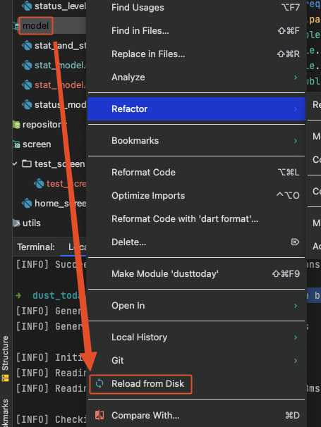

# Code Generation
```mdx-code-block
import Tabs from '@theme/Tabs';
import TabItem from '@theme/TabItem';
``` 

<Tabs>
  <TabItem value="Default">

  ```bash
  flutter pub run build_runner build
  ```
  
  </TabItem>
  <TabItem value="Remove Duplicate Value">

  ```bash 
  flutter pub run build_runner build --delete-conflicting-outputs
  ```
  
  </TabItem>
  <TabItem value="값 바뀌면 자동 적용">

  ```bash 
  flutter pub run build_runner watch 
  ```
  
  </TabItem>
</Tabs>

## Android Studio Freezed Snippets
[Link](https://plugins.jetbrains.com/plugin/18258-flutter-freezed-snippets)

## Reference 
[Flutter Happy Path Study 한석민님 발표 자료](https://sprinkle-ragdoll-faf.notion.site/Immutable-Data-bdca459ffa154be2a474a64a86217067)<br></br>
[Flutter Happy Path Study 쿠로곰님 발표 자료](https://curogom.notion.site/Immutable-Data-1e49e1f023064cd6a35aa5d7368dcae7)<br></br>
[Flutter Sondo GDG 오기환님 발표 자료](https://docs.google.com/presentation/d/1tVZKVjujP7tUGoz_XT7OyNpRvBzAIHDCM5zjQBGR8Zg/edit#slide=id.g125514d5365_0_10)<br></br>

## Error
### 생성된 파일이 안보일 때



