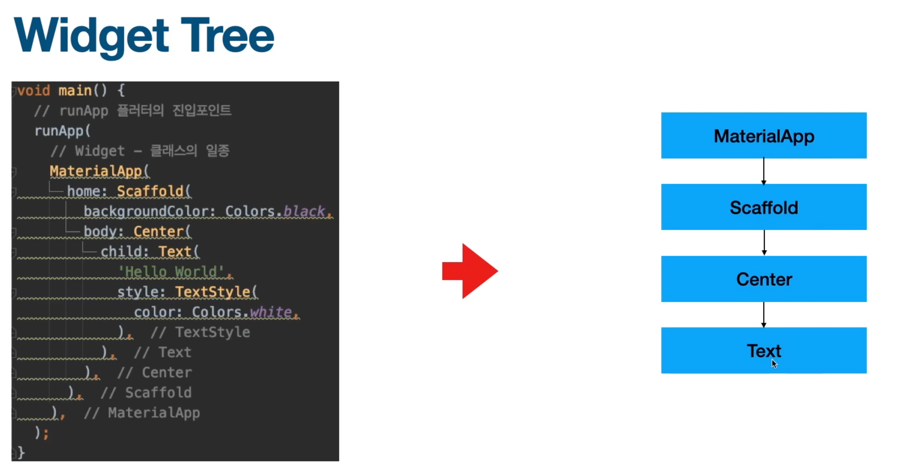
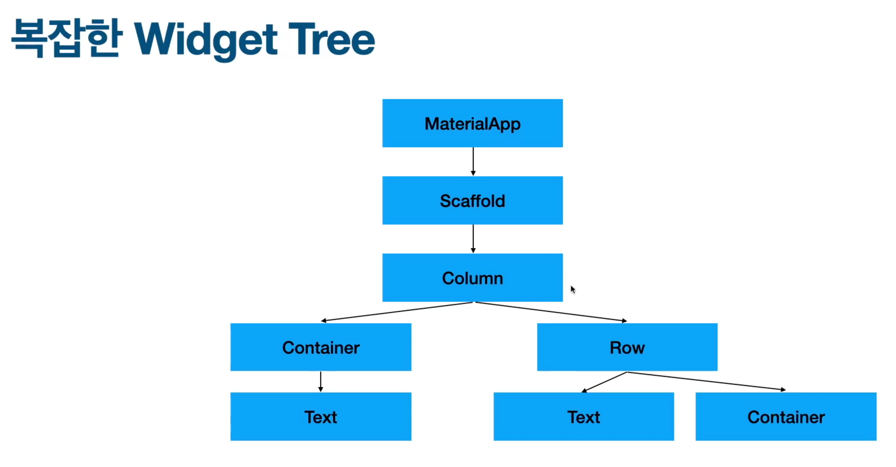
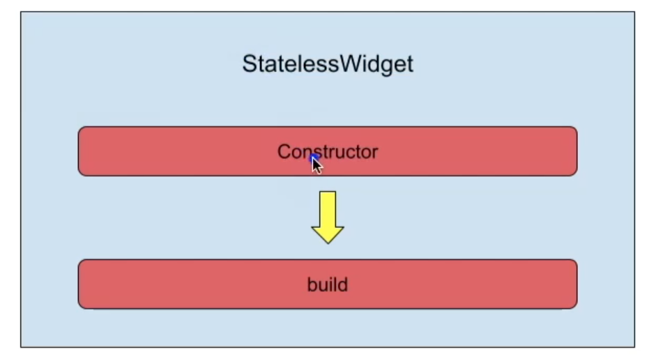
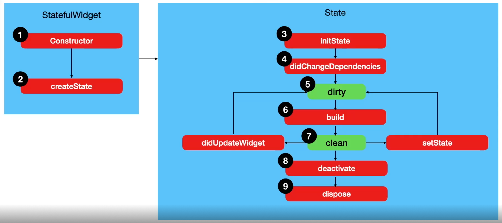
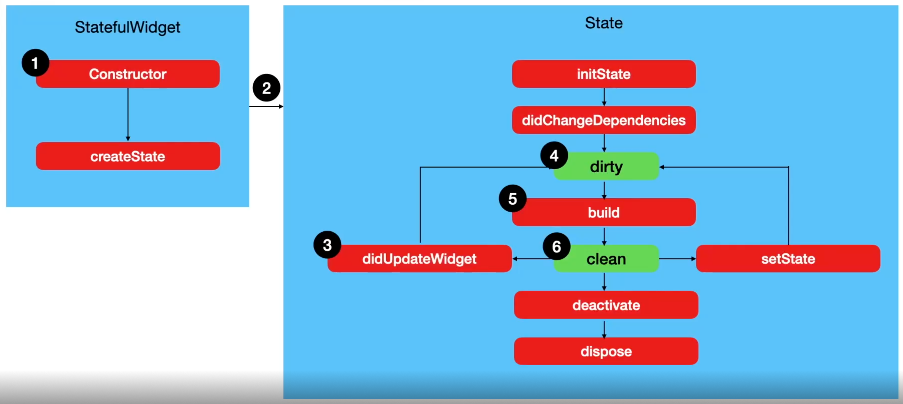
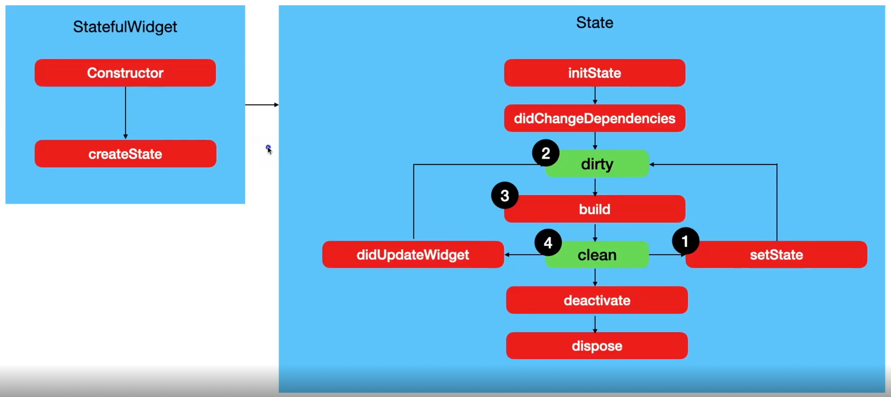
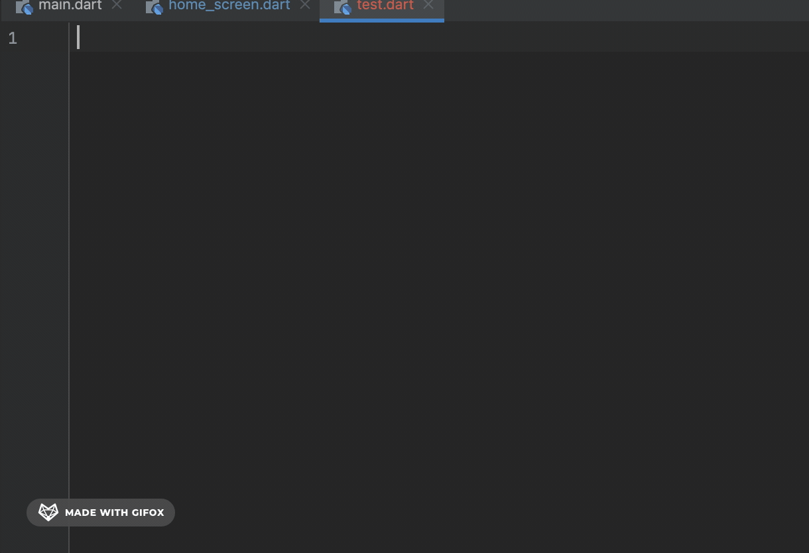
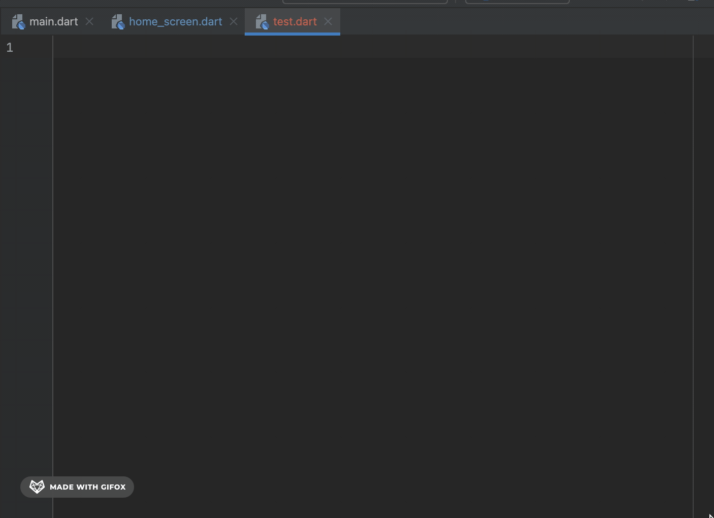
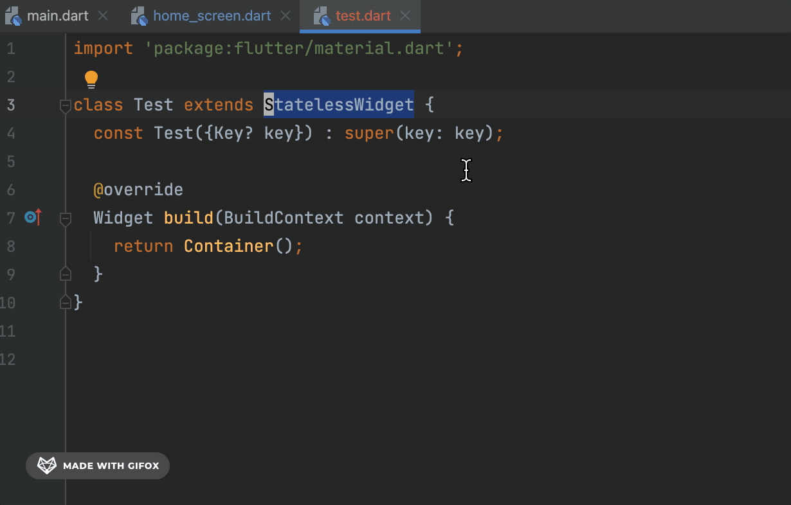

# Widget
## Widget Tree란?
Widget들의 부모, 자식 관계를 나타내는걸 Widget Tree라고 함.<br></br>
<br></br>
<br></br>

## Widget 이론
- Widget은 모두 "불변"의 법칙을 갖고 있음.
- 하지만 위젯의 값을 변경해야할 때가 있음.
- 변경이 필요하면 기존 위젯을 삭제해버리고 완전 새로운 위젯으로 대체함.


### StatelessWidget의 라이프 사이클
- [Constructor](https://rookedsysc.github.io/flutter/DartGrammar/#class-기본형)로 생성이되고 생성이 되자마자 [build](https://github.com/rookedsysc/Flutter-Study/blob/main/Project/splash_screen/lib/main.dart) 함수가 실행됨.
- 이전 Container 예제와 마찬가지로 변경이 필요하면 새로운 위젯을 만들어버림.
- 하나의 StatelessWidhget은 라이프 사이클동안 단 한번만 [build](https://github.com/rookedsysc/Flutter-Study/blob/main/Project/splash_screen/lib/main.dart) 함수를 실행함. (즉, 변경이 필요하면 현재 widget을 삭제하고 새로운 widget을 생성.)



### StatefulWidget

#### StatefulWidget의 라이프 사이클
상태를 관리할 수 있는 Widget. [build](https://github.com/rookedsysc/Flutter-Study/blob/main/Project/splash_screen/lib/main.dart) 함수를 여러번 바꿔줘야 하기 때문에 StatefullWidget과 State class로 나뉘었음.<br></br>


##### 파라미터가 바뀌었을 때 라이프 사이클
원래 있던 State를 재활용 함.<br></br>

##### setState를 실행했을 때 라이프 사이클
Parameter를 변경하면서 위젯을 통하지 않고 State 안에서 직접 실행함.


###### Reference
[re-build 되어도 re-load되지 않는 const property](http://lokigem.github.io/docs/Flutter/dartGrammar/DartGrammar/#const-re-build)

#### initState()
동영상 플레이어 프로젝트 중에서 

#### .widget의 의미
`Sate<>`에서 .widget을 사용해서 Stateful Widget에서 선언한 인스턴스에 접근할 수 있음.<br></br>
아래는 random_number_gernerater Project에서 사용한 모습.
```dart 
class SettingScreen extends StatefulWidget {
  final int maxNumber;
  const SettingScreen({required this.maxNumber, Key? key}) : super(key: key);

  @override
  State<SettingScreen> createState() => _SettingScreenState();
}

class _SettingScreenState extends State<SettingScreen> {
  double maxNumber = 1000;

  // setting State가 재생성되는 순간에만 이 인스턴스가 실행됨.
  // pop을 했다가 push를 하면 Stateful Widget을 재생성해줌.
  @override
  void initState() {
    super.initState();
    /******** widget Keyword를 사용해서 Stateful Widget에서 선언한 변수에 접근이 가능함.
    즉, home_screen에서 전달해준 maxNumber는 Stateful Widget에 담기고 initState()로
    State가 생성이 될 때 widget keyword를 사용해서 Stateful widget에 전달받은 maxNumber를
        State의 maxNumber에 넣어줌.
     */
    maxNumber = widget.maxNumber.toDouble();
  }
```
## Shortcut
- stless : stless까지 입력하고 Enter를 누르면 Stateless Widget이 자동으로 입력됨.



- stful : stful까지 입력하고 Enter를 누르면 Stateful Widget이 자동으로 입력됨.



- Stateless Widget > Stateful Widget : Stateless Widget을 드래그하고 "우클릭" > "Show Context Actions" (단축키 : Option + Enter) > "Convert to Stateful Widget"을 클릭하면 Stateless Widget에서 Stateful Widget으로 변함.



## Reference
[참조 Source Code](https://github.com/rookedsysc/Flutter-Study/blob/main/Project/flutter-lv1-theory-statefulwidget-before-main/lib/screen/home_screen.dart)