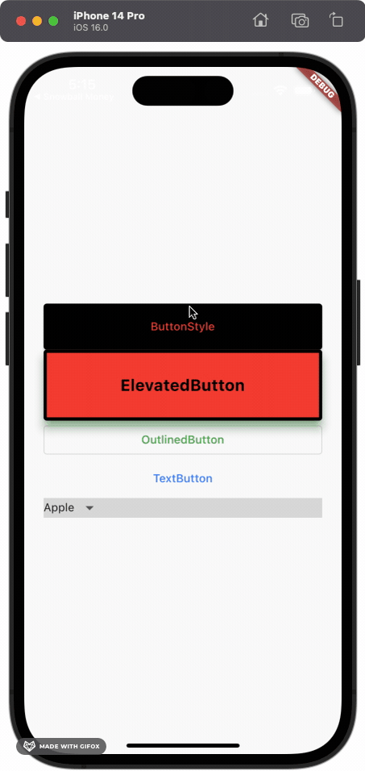

# Drop Down Button


## 사용방법 
items에는 DropdownMenumItem 타입의 리스트가 들어가야 함.
```dart
DropdownButton<String>( 
  value: selectedButton,
  isDense: true,
  elevation: 16,
  items: ['Apple', 'Cherry', 'Mango']
      .map((item) => DropdownMenuItem<String>(
            value: item,
            child: Text(
              item,
            ),
          ))
      .toList(),
  onChanged: (String? val) {
    setState(() {
      if (val != null) {
        selectedButton = val!;
      }
    });
  }),
```



## Error Fix
### items Error(중복값 오류)

:::warning 에러 내용
```bash
'items == null || items.isEmpty || value == null ||
              items.where((DropdownMenuItem<T> item) {
                return item.value == value;
              }).length == 1'
```
:::
 
- How To Fix? 

Stackoverflow를 뒤져보다가 값이 하나만 존재(중복되면 안됨)해야 한다는데서 아이디어를 얻어서 items에 들어가는 List를 Set로 변경해줌. 그 이후로 해결 됨.<br></br>
```dart
DropdownButton<String>( 
  value: selectedButton,
  isDense: true,
  elevation: 16,
  items: ['Apple', 'Cherry', 'Mango'].toSet // 이 부분 수정
      .map((item) => DropdownMenuItem<String>(
            value: item,
            child: Text(
              item,
            ),
          ))
      .toList(),
  onChanged: (String? val) {
    setState(() {
      if (val != null) {
        selectedButton = val!;
      }
    });
  }),
```